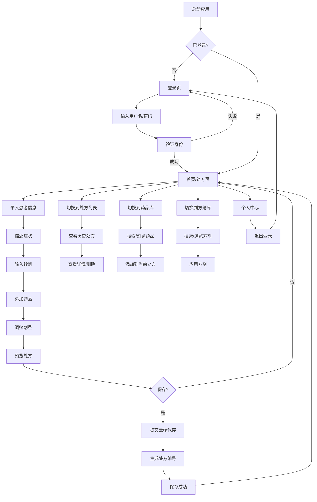

## 1. Product Overview
本能中医处方系统云端版手机H5应用，为中医师提供移动端处方开具、药品管理、方剂管理等核心功能，支持云端数据同步，随时随地管理处方业务。

## 2. Core Features

### 2.1 User Roles
| Role | Registration Method | Core Permissions |
|------|---------------------|------------------|
| Admin | 系统预置 | 管理药品库、方剂库、用户管理、查看所有处方 |
| User | 系统预置 | 开具处方、查看个人处方、使用药品库和方剂库 |

### 2.2 Feature Module
1. **登录页**：用户名密码登录、记住密码、版本信息
2. **首页/处方页**：患者信息录入、症状描述、诊断结果、药品选择、处方预览、保存处方
3. **处方列表页**：历史处方列表、处方详情查看、删除处方
4. **药品库页**：药品搜索、药品列表、药品详情、添加药品（管理员）
5. **方剂库页**：方剂搜索、方剂列表、方剂详情、方剂应用
6. **个人中心页**：用户信息、退出登录、版本信息

### 2.3 Page Details
| Page Name | Module Name | Feature description |
|-----------|-------------|---------------------|
| 登录页 | 登录表单 | 用户名/角色选择/密码输入、记住密码、登录按钮、版本显示 |
| 首页/处方页 | 患者信息 | 姓名、性别、年龄、电话、就诊日期输入 |
| 首页/处方页 | 症状描述 | 多行文本输入，支持换行 |
| 首页/处方页 | 诊断结果 | 文本输入 |
| 首页/处方页 | 药品列表 | 药品搜索添加、剂量调整、删除药品、价格计算 |
| 首页/处方页 | 处方预览 | 模拟纸质处方展示、打印准备 |
| 首页/处方页 | 操作按钮 | 保存处方、清空、应用方剂 |
| 处方列表页 | 列表展示 | 按日期倒序展示、处方编号、患者姓名、日期、详情查看 |
| 处方列表页 | 操作 | 删除处方（本人或管理员） |
| 药品库页 | 搜索 | 按名称或代码搜索药品 |
| 药品库页 | 列表 | 药品名称、代码、单位、默认剂量 |
| 药品库页 | 添加 | 管理员可添加新药品 |
| 方剂库页 | 搜索 | 按名称搜索方剂 |
| 方剂库页 | 列表 | 方剂名称、组成、功效 |
| 方剂库页 | 应用 | 将方剂药品添加到处方 |
| 个人中心页 | 用户信息 | 显示当前登录用户、角色 |
| 个人中心页 | 操作 | 退出登录、关于系统 |

## 3. Core Process

## 4. User Interface Design
### 4.1 Design Style
- **主色调**：中医绿色系 #2c5530（生命、健康、自然）
- **辅助色**：深红色 #8b0000（中医传统、处方标识）、深蓝色 #000080（强调、选中状态）
- **背景色**：浅灰色 #f5f5f5（舒适阅读）、白色卡片
- **按钮样式**：圆角矩形、绿色主按钮、红色危险按钮、灰色次要按钮
- **字体**：思源黑体（中文）、系统无衬线（英文数字）
- **布局**：卡片式布局、底部导航栏、顶部标题栏
- **图标**：简洁线性图标

### 4.2 Page Design Overview
| Page Name | Module Name | UI Elements |
|-----------|-------------|-------------|
| 登录页 | 登录容器 | 渐变背景、卡片式登录框、圆角输入框、大按钮 |
| 首页/处方页 | 患者信息区 | 表单网格布局、标签+输入框、图标标识 |
| 首页/处方页 | 药品表格 | 横向滚动表格、可编辑单元格、删除按钮 |
| 首页/处方页 | 处方预览 | A5纸张模拟、网格布局、中药处方格式 |
| 底部导航 | 导航栏 | 4个导航项、图标+文字、选中高亮 |
| 列表页 | 列表项 | 卡片式、左侧图标/缩略图、右侧信息 |
| 药品库页 | 搜索框 | 顶部搜索栏、实时搜索 |
| 个人中心页 | 用户卡片 | 圆形头像、用户信息、操作按钮列表 |

### 4.3 Responsiveness
- **移动端优先**：专为手机设计，375px-414px宽度优化
- **触摸优化**：按钮最小44px高度、输入框大字体、表格横向滚动
- **适配策略**：Flexbox/Grid布局、媒体查询适配不同屏幕

## 5. API Integration
- **云端API地址**：https://tcm-prescription-system.pages.dev/api
- **认证方式**：Basic Auth（username:role Base64编码）
- **核心接口**：
  - POST/GET /prescriptions：处方保存/列表
  - DELETE /prescriptions：删除处方
  - GET/POST /medicines：药品库读取/保存
  - GET/POST /formulas：方剂库读取/保存