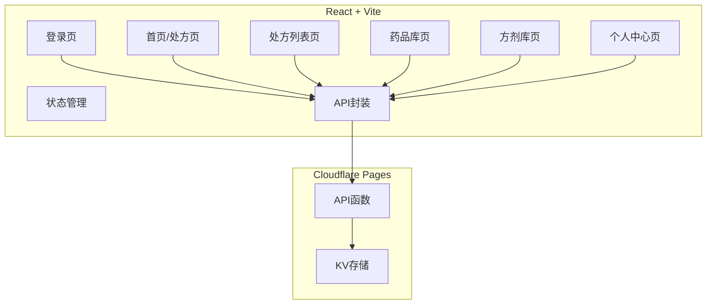
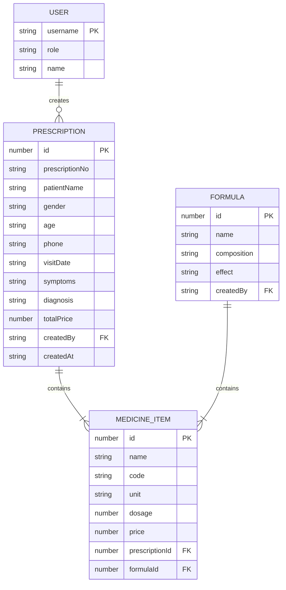

## 1. Architecture Design


## 2. Technology Description
- **Frontend**: React@18 + TypeScript + tailwindcss@3 + Vite
- **Initialization Tool**: vite-init (react-ts template)
- **State Management**: Zustand
- **Routing**: react-router-dom
- **Icons**: lucide-react
- **Backend**: Cloudflare Pages Functions（现有）
- **Database**: Cloudflare KV（现有）

## 3. Route Definitions
| Route | Purpose | Component |
|-------|---------|-----------|
| /login | 登录页面 | Login |
| / | 首页/处方开具页 | Home |
| /prescriptions | 处方列表页 | PrescriptionList |
| /medicines | 药品库页 | MedicineLibrary |
| /formulas | 方剂库页 | FormulaLibrary |
| /profile | 个人中心页 | Profile |

## 4. API Definitions
### 4.1 Auth Module
```typescript
interface User {
  username: string;
  role: 'admin' | 'user';
  name: string;
}

function getAuthToken(user: User): string;
function setCurrentUser(user: User): void;
function getCurrentUser(): User | null;
function isLoggedIn(): boolean;
function logout(): void;
```

### 4.2 Prescription API
```typescript
interface MedicineItem {
  id: number;
  name: string;
  code: string;
  unit: string;
  dosage: number;
  price: number;
}

interface Prescription {
  id: number;
  prescriptionNo: string;
  patientName: string;
  gender: string;
  age: string;
  phone: string;
  visitDate: string;
  symptoms: string;
  diagnosis: string;
  medicines: MedicineItem[];
  totalPrice: number;
  createdBy: string;
  createdAt: string;
}

async function savePrescription(prescription: Prescription): Promise<{ success: boolean; savedPrescription?: Prescription }>;
async function loadPrescriptions(): Promise<{ success: boolean; data: Prescription[] }>;
async function deletePrescription(id: number): Promise<{ success: boolean }>;
```

### 4.3 Medicine API
```typescript
interface Medicine {
  id: number;
  name: string;
  code: string;
  unit: string;
  defaultDosage: number;
  price?: number;
}

async function loadMedicines(): Promise<{ success: boolean; data: Medicine[] }>;
async function saveMedicines(medicines: Medicine[]): Promise<{ success: boolean }>;
```

### 4.4 Formula API
```typescript
interface Formula {
  id: number;
  name: string;
  composition: string;
  effect: string;
  medicines: MedicineItem[];
  createdBy?: string;
}

async function loadFormulas(): Promise<{ success: boolean; data: Formula[] }>;
async function saveFormulas(formulas: Formula[]): Promise<{ success: boolean }>;
```

## 5. Data Model
### 5.1 Data Model Definition


## 6. Project Structure
```
src/
├── components/
│   ├── Layout/
│   │   └── MainLayout.tsx
│   ├── Login/
│   │   └── LoginForm.tsx
│   ├── Prescription/
│   │   ├── PatientInfo.tsx
│   │   ├── MedicineTable.tsx
│   │   ├── PrescriptionPreview.tsx
│   │   └── ActionBar.tsx
│   ├── List/
│   │   └── ListItem.tsx
│   ├── Search/
│   │   └── SearchBar.tsx
│   └── Common/
│       ├── Modal.tsx
│       ├── Button.tsx
│       └── Input.tsx
├── pages/
│   ├── Login.tsx
│   ├── Home.tsx
│   ├── PrescriptionList.tsx
│   ├── MedicineLibrary.tsx
│   ├── FormulaLibrary.tsx
│   └── Profile.tsx
├── hooks/
│   ├── useAuth.ts
│   ├── usePrescription.ts
│   ├── useMedicines.ts
│   └── useFormulas.ts
├── stores/
│   ├── authStore.ts
│   └── prescriptionStore.ts
├── utils/
│   ├── api.ts
│   ├── auth.ts
│   └── helpers.ts
├── types/
│   └── index.ts
├── App.tsx
├── main.tsx
└── index.css
```

## 7. Security Considerations
- 使用 HTTPS 传输
- Basic Auth 认证
- 处方数据按用户隔离
- 敏感操作权限校验
- localStorage 存储登录态（含过期检查）