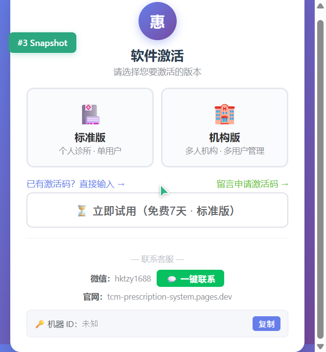
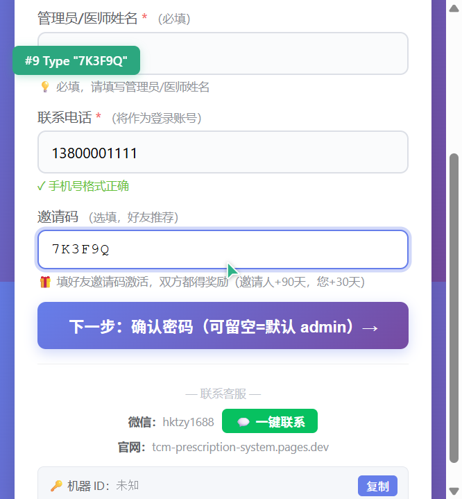
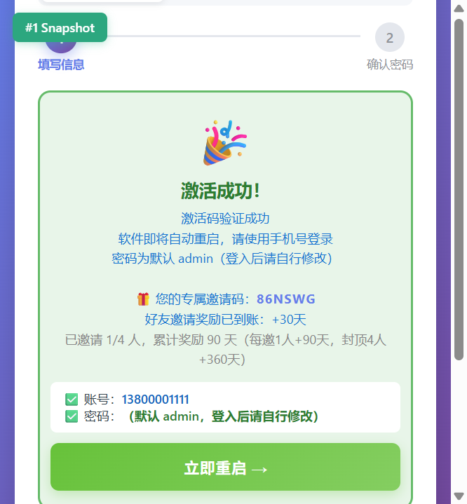

# 惠康中医 · 推广奖励操作图文指南

> 邀请好友激活，双方都得奖励：**好友每邀 1 人 +90 天（封顶 4 人 +360 天），您通过邀请码激活 +30 天**
> 以下截图均为**软件真实激活窗口界面**（桌面版；APP 端流程一致）。

---

## 第一步：打开软件，进入激活窗口

首次打开软件显示激活窗口，已有激活码的用户点击「**已有激活码？直接输入 →**」：

## 第二步：填写激活信息 + 好友邀请码

填写激活码、诊所名称、姓名、手机号；**关键一步**——在「邀请码」一栏填入好友发给你的邀请码（没有可留空）：

> 🎁 填好友邀请码激活，双方都得奖励（**好友 +90 天，您 +30 天**）

## 第三步：确认密码（可留空）

密码可留空（默认 admin，登录后可修改），点击「🚀 立即激活」：

## 第四步：激活成功，领取你的专属邀请码

激活成功页会显示**你的专属邀请码**（如 86NSWG）——把它发给好友，好友激活时填入，你的奖励天数自动到账：

## 第五步：转发邀请码给好友（微信即可）

把上面的邀请码发给同行好友，附一句话即可：

> 「我用的这个开方软件不错，激活时填我的邀请码 **86NSWG**，你多得 30 天使用期，我也有奖励，双赢！」

好友按上面第一~三步操作，在邀请码栏填入 **86NSWG** 激活成功后，奖励自动入账。

---

## 奖励规则速查

| 场景 | 奖励 |
|---|---|
| 你邀请第 1 位好友付费激活 | 你 +90 天，好友 +30 天 |
| 第 2 位 | 你累计 +180 天，好友 +30 天 |
| 第 3 位 | 你累计 +270 天，好友 +30 天 |
| 第 4 位（封顶） | 你累计 **+360 天**，好友 +30 天 |

**常见问题**

| 问题 | 答案 |
|---|---|
| 奖励怎么到账？ | 邀请成功立即记账；你的软件下次在线验证或重新激活一次（同码同设备**免费、不限次数**）即生效延期 |
| 到期时间会变吗？ | 不会。有效期始终从**首次激活日**起算（365天+奖励天数），重装软件、换电脑都不影响 |
| 试用激活算邀请成功吗？ | 不算，好友需付费激活才计奖励 |
| 邀请码在哪里看？ | 激活成功页显示；也可在软件内查看授权信息 |

---

*截图说明：步骤1-3 为真实激活窗口实际操作截图；步骤4 为同一真实界面演示数据（邀请码 86NSWG 为示例）。*
