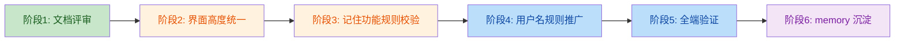

# 登入权限优化模块

> **创建日期**：2026-07-26
> **模块定位**：平台管理员/管理员/普通用户权限与登入问题的统一优化方案
> **核心目标**：用户名规则定型、登入界面高度统一、记住功能规则固化、自动登入永久禁用
> **关系**：本文档为优化决策与实施计划；历史 BUG 复盘见 `login-and-authentication.md`；权限函数实现见 `权限设计文档.md`

---

## 一、角色与权限汇总

### 1.1 角色体系

| 体系 | 角色 | role 值 | 适用版本 | 典型场景 |
|------|------|---------|---------|---------|
| 云端 | 平台总管理员 | `platform_admin` | 仅云端版 | 多诊所 SaaS 平台运维 |
| 云端 | 诊所管理员 | `clinic_admin` | 仅云端版 | 单诊所用户管理、药品管理 |
| 云端 | 医师 | `doctor` | 仅云端版 | 处方录入、查看自己的处方 |
| 离线 | 管理员 | `admin` | 本地版/定制版 | 单诊所用户管理、修改密码 |
| 离线 | 普通用户 | `user` | 本地版/定制版 | 修改密码、查看自己的处方 |
| 个人 | 单用户 | `personal`（由 edition 区分） | 个人版 | 单医生使用，固定账号 |

### 1.2 角色映射关系

| 离线版 | 云端版 | 等价权限 |
|--------|--------|---------|
| `admin` | `clinic_admin` | 诊所级管理员 |
| `user` | `doctor` | 普通医师 |
| — | `platform_admin` | 平台级管理员（仅云端） |

### 1.3 完整权限矩阵

| 功能 | 平台管理员 | 诊所管理员 | 医师 | 离线 admin | 离线 user | 个人版 |
|------|-----------|-----------|------|-----------|----------|--------|
| 平台管理入口 | ✅ | ❌ | ❌ | ❌ | ❌ | ❌ |
| 处方监管（跨诊所） | ✅ | ❌ | ❌ | ❌ | ❌ | ❌ |
| 用户管理 | ❌ | ✅ | ❌ | ✅ | ❌ | ❌ |
| 修改密码 | ✅ | ❌（由账户管理覆盖） | ✅ | ❌（由账户管理覆盖） | ✅ | ✅ |
| 开机自启 | ❌ | ✅ | ❌ | ✅ | ❌ | ❌ |
| 药品管理 | ✅ | ✅ | ✅ | ✅ | ✅ | ✅ |
| 查看所有处方 | ❌ | ✅ | ❌ | ✅ | ❌ | ✅（仅自己） |
| 诊所名称编辑 | ✅ | ✅ | ✅ | ✅ | ✅ | ❌（只读） |
| 医师姓名编辑 | ✅ | ✅ | ✅ | ✅ | ✅ | ❌（只读） |
| 同步功能 | ✅ | ✅ | ✅ | ❌ | ❌ | ❌ |

### 1.4 移动端按钮（mobile-action-bar）

| 按钮 | 平台管理员 | 诊所管理员 | 医师 | 离线 admin | 离线 user | 个人版 |
|------|-----------|-----------|------|-----------|----------|--------|
| 👥 账户 | ❌ | ✅ | ❌ | ✅ | ❌ | ❌ |
| 🔑 改密 | ✅ | ❌ | ✅ | ❌ | ✅ | ✅ |

> **说明**：管理员不显示"改密"按钮，因其密码管理由"账户管理"覆盖；普通用户/医师/平台管理员显示"改密"。

---

## 二、用户名规则决策

### 2.1 中文用户名 vs 英文用户名优缺点对比

| 维度 | 中文用户名 | 英文用户名 |
|------|----------|----------|
| **用户体验** | 国内医生友好，记忆直观 | 医生记忆不便，需额外培训 |
| **一致性** | 与处方签医师名（中文）一致，无映射成本 | 与处方签医师名割裂，需维护"英文→中文"映射 |
| **btoa 编码** | 已通过 `encodeURIComponent + TextEncoder` 解决（BUG-AUTH-01） | 无编码问题 |
| **URL 传参** | 需 `encodeURIComponent`（项目已统一使用） | 无需编码 |
| **Base64 加密** | 已通过 `TextEncoder + btoa` 组合解决 | 无加密障碍 |
| **数据库存储** | UTF-8 字符集已普及，无障碍 | ASCII 兼容性最佳 |
| **跨平台** | Capacitor/Electron/Web 均已支持 | 兼容性最佳 |
| **API 后端** | Cloudflare KV/Pages Functions 已支持 UTF-8 | 兼容性最佳 |
| **键盘输入** | 需切换中文输入法 | 直接英文输入 |
| **可读性** | 高（直接看到医生姓名） | 低（需查映射表） |
| **历史 BUG 风险** | 已修复，且代码已加防御 | 无风险 |

### 2.2 决策结果

> **统一采用中文用户名**

**理由**：
1. **技术障碍已全部清除**：BUG-AUTH-01（btoa Unicode 问题）已通过 `encodeURIComponent + escape` 与 `TextEncoder + btoa` 双重方案解决，并已沉淀为硬约束。
2. **业务一致性最高**：处方签医师名、诊所名均为中文，用户名同为中文可避免"登入用英文、开方用中文"的认知割裂。
3. **用户群体匹配**：本系统面向中医诊所医生，中文用户名最符合用户习惯。
4. **维护成本最低**：无需维护"英文用户名↔中文医师名"映射表。
5. **键盘输入代价可接受**：登入仅在启动时输入一次，中文输入法切换成本远低于长期维护英文用户名的认知成本。

### 2.3 使用规则（强制约束）

| 规则编号 | 内容 |
|---------|------|
| UN-1 | 所有版本（云端/本地/定制/个人）的用户名统一使用中文 |
| UN-2 | 用户名建议为 2-6 个中文字符（与医师姓名一致） |
| UN-3 | 个人版默认账号名建议为诊所医师本人姓名（如"卢二灼"） |
| UN-4 | 平台管理员账号可使用"平台管理"或运维人员姓名 |
| UN-5 | 创建用户时前端需校验非空，长度 2-10 字符 |
| UN-6 | 所有 Base64 编码必须使用 `TextEncoder + btoa` 或 `encodeURIComponent + escape + btoa` 组合，禁止直接 `btoa(unicode_string)` |
| UN-7 | 所有 URL 传参必须 `encodeURIComponent(username)` |

---

## 三、登入界面高度统一规范

### 3.1 现状差异诊断

| 维度 | 云端桌面版 | 离线本地版 | 离线定制版 | 个人版 | 是否一致 |
|------|----------|----------|----------|-------|---------|
| 版本标识 | 【云版】 | 【本地】 | 【定制】 | 【个人】 | ✅ 文字格式一致 |
| 系统标题 | 惠康中医诊所管理系统 | 同左 | 同左 | 同左 | ✅ 一致 |
| 容器宽度 | 230px | 230px | 230px | 230px | ✅ 一致 |
| 用户名输入 | input + 下拉按钮 | select 下拉框 | select 下拉框 | input（readonly） | ❌ **不一致** |
| "记住用户" | 默认显示 | 默认显示 | 默认显示 | 默认隐藏 | ✅ 由 permission.js 控制 |
| "记住密码" | permission.js 控制 | permission.js 控制 | permission.js 控制 | 默认显示 | ✅ 由 permission.js 控制 |
| 微信号位置 | login-box 内（login-footer） | login-container 末尾（footer-section） | login-container 末尾（footer-section） | login-container 末尾（footer-section） | ❌ **不一致** |
| 字段间距 | gap: 4px, margin: 12px | 同左 | 同左 | 同左 | ✅ 一致 |
| 字体大小 | label 10px / input 11px | 同左 | 同左 | 同左 | ✅ 一致 |

### 3.2 统一规范（强制约束）

| 规则编号 | 内容 |
|---------|------|
| UI-1 | **所有版本的 footer 一律放在 login-container 末尾的 footer-section**，禁止放在 login-box 内 |
| UI-2 | **所有非个人版的用户名输入统一为 input + 下拉按钮**（取代 select 下拉框），与云端桌面版对齐 |
| UI-3 | **个人版的用户名输入框保持 input readonly**，由 permission.js 自动填充单一账号 |
| UI-4 | **所有版本字段顺序固定为**：诊所名 → 用户名 → 密码 → 记住用户 → 记住密码 → 按钮 → 错误提示 |
| UI-5 | **所有版本容器宽度统一为 230px**，禁止单独调整 |
| UI-6 | **所有版本字体大小统一**：系统标题 13px、版本标签 9px、字段标签 10px、输入框 11px、按钮 11px、错误提示 9px、footer 8px |
| UI-7 | **所有版本配色统一**：背景渐变 `#667eea → #764ba2`、按钮渐变同左、错误提示 `#dc2626` |
| UI-8 | **所有版本按钮文字统一**：确定 / 取消 |
| UI-9 | **所有版本必须包含 footer 微信号**："微信号: yqjzy1688" |
| UI-10 | **所有版本必须引入 auth-core.js + permission.js + login.js（或内嵌等价逻辑）** |

### 3.3 用户名输入方式统一方案

#### 3.3.1 非个人版（云端桌面版 / 离线本地版 / 离线定制版）

统一采用 **input + 下拉按钮** 模式（参考云端桌面版实现）：

```html
<div class="login-field">
    <label>用户名</label>
    <div class="username-input-wrapper">
        <input type="text" id="loginUsername" placeholder="请输入用户名"
               autocomplete="off" autocapitalize="off" autocorrect="off"
               spellcheck="false">
        <button id="usernameDropdownBtn" class="username-dropdown-btn" type="button">▼</button>
        <div id="usernameDropdownMenu" class="username-dropdown-menu"></div>
    </div>
</div>
```

**优点**：
- 既支持手动输入（便于新用户首次登入）
- 又支持历史用户名快捷选择（下拉按钮显示记住的用户列表）
- 与云端桌面版完全一致，跨端体验统一
- 避免 select 在不同操作系统的样式差异

#### 3.3.2 个人版

保持 **input readonly** 模式，由 permission.js 自动填充 config.users[0].username：

```html
<div class="login-field">
    <label>用户名</label>
    <input type="text" id="loginUsername" readonly class="readonly"
           style="background:#f0f0f0;color:#555;cursor:default;">
</div>
```

### 3.4 footer 位置统一方案

所有版本的 footer 一律移到 login-container 末尾的 footer-section：

```html
<div class="login-container">
    <div class="bg-decoration"></div>
    <div class="header-section">...</div>
    <div class="main-content">
        <div class="login-box">...</div>
    </div>
    <div class="footer-section">微信号: yqjzy1688</div>
</div>
```

**云端桌面版需调整**：将 login-box 内的 `<div class="login-footer">微信号: yqjzy1688</div>` 移除，在 login-container 末尾新增 footer-section。

---

## 四、记住功能规则（强制约束）

### 4.1 规则矩阵

| 版本 | "记住用户" | "记住密码" | 说明 |
|------|-----------|-----------|------|
| 云端版（网页/桌面/APP） | ✅ 显示 | ❌ 隐藏 | 多用户共享设备，记住密码有安全风险 |
| 离线本地版（桌面/APP） | ✅ 显示 | ❌ 隐藏 | 同上 |
| 离线定制版（桌面/APP） | ✅ 显示 | ❌ 隐藏 | 同上 |
| 个人版（桌面/APP） | ❌ 隐藏 | ✅ 显示 | 单用户固定账号无需记住用户名；单设备单用户可记住密码 |

### 4.2 实现机制（已由 permission.js 完成）

```javascript
// permission.js
hasRememberPassword() {
    return this.isPersonal();  // 仅个人版显示"记住密码"
},
hasUsernameDropdown() {
    return !this.isPersonal();  // 非个人版显示用户名下拉
},

// applyLoginPermissions()
const rememberPwdContainer = document.getElementById('rememberPasswordContainer');
if (rememberPwdContainer) {
    rememberPwdContainer.style.display = this.hasRememberPassword() ? 'flex' : 'none';
}
```

### 4.3 个人版"记住用户"隐藏方式

个人版"记住用户"checkbox 通过 HTML 静态隐藏（`style="display:none;"`），不依赖 JS：

```html
<div class="login-field remember-me" style="display:none;">
    <input type="checkbox" id="rememberUser">
    <label for="rememberUser">记住用户</label>
</div>
```

**理由**：个人版用户名由 config.users[0].username 自动填充，"记住用户"无意义；静态隐藏可避免 JS 异常时误显示。

### 4.4 记住密码的安全要求

| 规则编号 | 内容 |
|---------|------|
| RP-1 | 个人版"记住密码"必须使用 `AuthCore.encryptPassword` 加密存储，禁止明文持久化 |
| RP-2 | 优先使用 Electron safeStorage（系统级加密），降级使用 XOR + 用户标识派生密钥 |
| RP-3 | 加密前缀标识：`SAFE:`（safeStorage）/ `PWDv2:`（XOR 派生）/ `PWDv1:`（旧版 XOR 固定密钥） |
| RP-4 | 解密失败（如跨用户/跨机器迁移）时清空保存的密码，让用户重新输入 |
| RP-5 | AuthCore.encryptPassword 不可用时拒绝保存密码，并提示"加密模块未就绪" |
| RP-6 | "记住密码"与"记住用户"互相独立，可单独勾选 |

---

## 五、自动登入永久禁用机制

### 5.1 核心原则

> **永远不设定自动登入**：每次启动应用必须由用户手动输入密码完成登入。

### 5.2 已实施的禁用措施（汇总）

| 层级 | 措施 | 文件 |
|------|------|------|
| 浏览器自动填充 | `autocomplete="new-password"` | 各 login.html 密码输入框 |
| LastPass 等扩展 | `data-lpignore="true"` | 各 login.html 密码输入框 |
| 激活码输入框 | `autocomplete="off"` + `spellcheck="false"` | activate-window.html |
| Android Autofill（5层防护） | Manifest + Activity + WebView + 输入框 + JS 桥接 | MainActivity.java / AndroidManifest.xml |
| APP 启动检查 | 启动时强制检查登入状态，超时或异常时 logout | 各 APP index.html |
| 会话超时 | 8 小时后自动 logout | auth-core.js checkSession |
| 个人版保存密码 | 加密存储，但启动时仍需用户点击"确定"按钮触发登入 | login.js |

### 5.3 启动行为规范（强制约束）

| 规则编号 | 内容 |
|---------|------|
| AL-1 | 所有版本启动时必须显示登入界面，禁止跳过登入直接进入主界面 |
| AL-2 | 个人版即使"记住密码"已勾选，也必须由用户主动点击"确定"按钮完成登入 |
| AL-3 | APP 退出（onPause/onDestroy）后再次打开必须重新登入 |
| AL-4 | 会话超时（8小时）后必须重新登入 |
| AL-5 | 禁止使用 sessionStorage 之外的任何机制实现"刷新页面自动登入" |
| AL-6 | 禁止在启动时自动调用 `AuthCore.login()`，必须由用户交互触发 |

---

## 六、实施计划

### 6.1 实施分阶段



### 6.2 阶段 1：文档评审（已完成）

| 步骤 | 内容 | 状态 |
|------|------|------|
| 1.1 | 创建本优化模块文档 | ✅ 完成 |
| 1.2 | 用户评审决策（用户名规则/界面统一度/范围） | ✅ 完成 |
| 1.3 | 用户最终确认本文档 | ⏳ 待确认 |

### 6.3 阶段 2：界面高度统一（待执行）

| 步骤 | 内容 | 影响文件 | 风险 |
|------|------|---------|------|
| 2.1 | 运行 `check-interface.bat` 建立基线 | - | 低 |
| 2.2 | 云端桌面版 login.html：footer 从 login-box 移到 footer-section | cloud_project/cloud_desktop/electron/login.html | 中 |
| 2.3 | 离线本地版 login.html：select 改为 input + 下拉按钮 | offline_project/db-bendi/electron/login.html | 中 |
| 2.4 | 离线定制版 login.html：select 改为 input + 下拉按钮 | offline_project/db-dingzhi/electron/login.html | 中 |
| 2.5 | 离线本地版 login.js：适配 input + 下拉按钮模式 | offline_project/db-bendi/electron/login.js | 中 |
| 2.6 | 离线定制版 login.js：适配 input + 下拉按钮模式 | offline_project/db-dingzhi/electron/login.js | 中 |
| 2.7 | 同步变更到对应 APP 版本 index.html（仅 script 内逻辑） | offline_project/db-*/android/.../index.html | 中 |
| 2.8 | 运行 `check-interface.bat` 验证界面未被破坏 | - | 低 |

> **注意**：本阶段涉及 HTML/CSS 修改，需先告知用户并获得明确同意（Interface Protection 约束）。

### 6.4 阶段 3：记住功能规则校验（待执行）

| 步骤 | 内容 | 验证方式 |
|------|------|---------|
| 3.1 | 校验云端桌面版"记住密码"由 permission.js 隐藏 | 实测登入界面 |
| 3.2 | 校验离线本地版"记住密码"由 permission.js 隐藏 | 实测登入界面 |
| 3.3 | 校验离线定制版"记住密码"由 permission.js 隐藏 | 实测登入界面 |
| 3.4 | 校验个人版"记住用户"静态隐藏 | 实测登入界面 |
| 3.5 | 校验个人版"记住密码"加密存储（SAFE:/PWDv2: 前缀） | localStorage 检查 |
| 3.6 | 校验解密失败时清空保存的密码 | 跨用户测试 |

### 6.5 阶段 4：用户名规则推广（待执行）

| 步骤 | 内容 | 影响范围 |
|------|------|---------|
| 4.1 | 检查所有版本现有用户名是否包含英文，列出清单 | 全端用户数据 |
| 4.2 | 与用户沟通是否需要将现有英文用户名迁移为中文 | 决策点 |
| 4.3 | 用户管理界面增加中文用户名校验（长度 2-10 字符） | 各 index.html 用户管理弹窗 |
| 4.4 | 平台管理员账号默认建议"平台管理" | 云端版 bootstrap |

### 6.6 阶段 5：全端验证（待执行）

按 `login-and-authentication.md` §7.1 登入功能测试清单逐项验证：
- 云端网页版/桌面版/APP 登入（管理员/普通用户）
- 离线桌面版登入（bendi/dingzhi/geren）
- 离线 APP 登入（bendi/dingzhi/geren）
- 登入后 token 持久化
- 登出后状态完全清除
- Android Autofill 未弹出
- 记住用户/密码功能正常
- 权限判断一致

### 6.7 阶段 6：memory 沉淀（待执行）

- 将本优化模块关键决策追加到 `project_memory.md` 的 Hard Constraints
- 在 `login-and-authentication.md` 中追加"中文用户名规则"和"界面高度统一规范"章节
- 记录实施过程中发现的新问题到对应 BUG 复盘表

---

## 七、各端生效方式（实施后）

| 端 | 生效方式 |
|----|---------|
| 云端网页版 | 推送 GitHub 自动部署（Cloudflare Pages） |
| 云端桌面版（Electron） | 修改 login.html 后需重新打包 exe |
| 云端 APP（Capacitor） | 从 URL 加载，推送 GitHub 后无需重新打包 APK |
| 离线桌面版（bendi/dingzhi/geren） | 修改 login.html/login.js 后需重新打包 exe |
| 离线 APP（bendi/dingzhi/geren） | 修改 index.html 后需重新打包 APK |

---

## 八、风险控制

### 8.1 兼容性风险

| 风险 | 控制措施 |
|------|---------|
| select 改 input 后用户名下拉逻辑断裂 | 复用云端桌面版已验证的 `renderRememberedUsers` 实现 |
| footer 移位导致样式错乱 | 保持 footer-section 的 CSS 与其他版本完全一致 |
| 个人版"记住用户"误显示 | HTML 静态 `display:none`，不依赖 JS |
| 中文用户名在旧客户端编码失败 | 已修复（BUG-AUTH-01），代码已加 encodeURIComponent 防御 |
| 自动登入误启用 | AL-1 ~ AL-6 强制约束 + 启动时检查登入状态 |

### 8.2 回滚方案

| 阶段 | 回滚方式 |
|------|---------|
| 阶段 2（界面统一） | Git revert 对应 commit，HTML/CSS 自动恢复 |
| 阶段 3（记住功能） | 无代码变更，仅需重新校验 |
| 阶段 4（用户名规则） | 用户数据迁移可逆，git revert 校验代码 |

### 8.3 界面保护约束

> **Interface Protection**：优化前必须运行 `check-interface.bat` 建立基线，优化后必须运行 `check-interface.bat` 验证界面未被破坏。只允许修改 main.js/MainActivity.java/auth-core.js/build.gradle/proguard/build.bat 等逻辑文件，禁止修改 index.html 的 `<body>` 内 DOM 结构、`<style>` 部分、mobileNav/mobileActionBar 按钮配置、login.html/login.js 的 UI 部分。若必须改界面文件，需先告知用户并获得明确同意。

**本模块涉及的界面修改清单**（实施前需用户明确同意）：
- `cloud_project/cloud_desktop/electron/login.html`（footer 位置）
- `offline_project/db-bendi/electron/login.html`（select → input）
- `offline_project/db-dingzhi/electron/login.html`（select → input）
- `offline_project/db-bendi/electron/login.js`（下拉按钮逻辑）
- `offline_project/db-dingzhi/electron/login.js`（下拉按钮逻辑）

---

## 九、关键文件索引

### 登入核心
- `offline_project/_shared/auth-core.js` — 认证核心（MasterKey/hashPassword/login/logout/encryptPassword）
- `offline_project/_shared/permission.js` — 版本+角色复合权限判断
- `cloud_project/cloud_desktop/electron/auth-core.js` — 云端桌面版认证核心
- `cloud_project/cloud_desktop/electron/permission.js` — 云端桌面版权限模块

### 登入界面
- `cloud_project/cloud_desktop/electron/login.html` — 云端桌面版登入界面
- `offline_project/db-bendi/electron/login.html` — 离线本地版登入界面
- `offline_project/db-dingzhi/electron/login.html` — 离线定制版登入界面
- `offline_project/db-geren/electron/login.html` — 个人版登入界面

### 登入逻辑
- `offline_project/db-bendi/electron/login.js` — 离线本地版登入逻辑
- `offline_project/db-dingzhi/electron/login.js` — 离线定制版登入逻辑
- `offline_project/db-geren/electron/login.js` — 个人版登入逻辑

### Android 登入
- `offline_project/db-*/android/app/src/main/java/com/benneng/pres/MainActivity.java`
- `offline_project/db-*/android/app/src/main/AndroidManifest.xml`

### 后端 API
- `functions/api/users.js` — 用户管理后端 API
- `functions/api/_lib/auth.js` — 认证中间件

### 关联文档
- `docs/权限设计文档.md` — 权限矩阵与角色定义
- `docs/登录认证模块统一改造方案.md` — auth-core.js 改造方案
- `c:/Users/61767/.trae-cn/memory/projects/-d-trae-projects-kyt-zy/login-and-authentication.md` — 登入认证历史 BUG 复盘

---

## 十、决策记录

| 决策编号 | 内容 | 决策日期 | 决策依据 |
|---------|------|---------|---------|
| D-01 | 统一采用中文用户名 | 2026-07-26 | btoa 编码问题已修复；与处方签医师名一致；用户群体匹配 |
| D-02 | 仅创建优化模块文档（不立即实施代码改动） | 2026-07-26 | 用户明确要求先文档后实施 |
| D-03 | 登入界面高度统一 | 2026-07-26 | footer 位置、用户名输入方式、字段间距全部对齐 |
| D-04 | 个人版"记住密码"、其他版本"记住用户" | 2026-07-26 | 单用户 vs 多用户场景差异；安全风险考量 |
| D-05 | 永远不设定自动登入 | 2026-07-26 | 用户硬约束（user_profile） |

---

> 本文档为登入权限优化模块的决策与实施计划，实施时需按阶段逐步推进，每个阶段完成后更新本文档状态。
