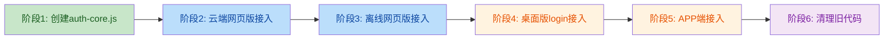

# 登录认证模块统一改造方案

> **生成日期**：2026-07-15
> **目标**：消除 10+ 个文件中的登录逻辑重复，统一密码加密、存储 key、退出登录、记住用户名四大核心逻辑

---

## 一、现状问题诊断

### 1.1 架构现状

```
当前状态：7 端各自实现，代码重复且不一致

┌─────────────────────────────────────────────────────┐
│  云端网页版 (public/index.html)                      │
│  ├─ 后端API登录 + cloud_currentUser 存储             │
│  └─ doLogout 清除6个key                              │
├─────────────────────────────────────────────────────┤
│  云端桌面版 (cloud_desktop/electron/login.html)     │
│  ├─ 内嵌JS后端API登录 + cloud_ 存储前缀              │
│  └─ 独立下拉按钮实现                                  │
├─────────────────────────────────────────────────────┤
│  云端桌面版 (public/electron/login.html)            │
│  ├─ 本地用户列表登录 + require('electron')           │
│  └─ 完全不同的handleLogin实现                        │
├─────────────────────────────────────────────────────┤
│  离线桌面版 ×3 (login.js)                           │
│  ├─ 本地SHA-256验证 + IPC getAppConfig              │
│  ├─ db-bendi/db-dingzhi: 多用户select下拉           │
│  └─ db-geren: 单用户固定显示                         │
├─────────────────────────────────────────────────────┤
│  离线网页版 ×5 (index.html)                         │
│  ├─ 本地SHA-256 + simpleEncrypt用户列表加密          │
│  ├─ db-bendi/db-dingzhi: 多用户                      │
│  ├─ db-geren: 单用户                                 │
│  └─ db-shouji: APP端asyncStorage                    │
├─────────────────────────────────────────────────────┤
│  云端APP (cloud_app/index.html)                     │
│  └─ 同云端网页版但运行在Capacitor中                   │
└─────────────────────────────────────────────────────┘
```

### 1.2 核心差异矩阵

| 维度 | 云端网页/APP | 云端桌面×2 | 离线桌面×3 | 离线网页×5 |
|------|------------|-----------|-----------|-----------|
| **登录验证** | 后端API `POST /users?login=true` | 后端API 或 本地验证 | 本地 `hashPassword()` SHA-256 | 本地 `hashPassword()` SHA-256 |
| **密码存储** | 后端KV（SHA-256 hash） | localStorage 明文/hash | localStorage hash | `simpleEncrypt` XOR+btoa |
| **登录态key** | `cloud_currentUser` + `cloud_isLoggedIn` + sessionStorage | `currentUser` + `isLoggedIn` | `currentUser` + `isLoggedIn` | `currentUser` + `isLoggedIn` + `user_login_data` |
| **记住用户名key** | `cloud_rememberedUsers` (数组) | `cloud_rememberedUsers` 或 无 | `local_rememberedUsername` | `local_rememberedUsers` + asyncStorage抽象 |
| **退出登录** | `doLogout()` 清6个key | `checkLoginStatus()` 显示遮罩 | `checkLoginStatus()` 显示遮罩 | `checkLoginStatus()` 显示遮罩 |
| **会话超时** | 8h (检查`user_login_data`) | 无 | 无 | 8h (检查`user_login_data`) |
| **错误处理** | try-catch + cloudFetch重试 | 部分有try-catch | login.js有 | handleLogin有try-catch |
| **crypto.subtle降级** | 无 | 无 | 无（catch返回明文） | 无（catch返回明文） |

### 1.3 历史BUG关联

| BUG编号 | 修复次数 | 根因 | 与本方案关系 |
|---------|---------|------|------------|
| BUG-SYNC-03 多用户名记住 | 8次 | 每端独立实现，key不统一 | 统一存储key + 统一实现 |
| BUG-SYNC-04 退出后跳过登录 | 4次 | 清除key不完整 | 统一doLogout清除所有key |
| BUG-AUTH-01 密码加密btoa | 3次 | simpleEncrypt Unicode限制 | 统一加密函数 + 消除前端密码比较 |
| BUG-AUTH-03 无密码用户 | 4次 | 数据完整性约束缺失 | 统一用户创建+登录校验 |
| BUG-AUTH-04 权限判断分散 | 5次 | allowedMode默认值不统一 | 统一权限解析函数 |
| BUG-SYNC-01 allowedMode矛盾 | 3次 | 同上 | 同上 |

---

## 二、统一架构设计

### 2.1 目标架构

```
改造后：1 个共享模块 + 各端薄适配层

┌─────────────────────────────────────────────────────┐
│              auth-core.js (共享核心模块)               │
│  ┌─────────────┐ ┌──────────────┐ ┌───────────────┐ │
│  │ 密码加密层   │ │ 存储抽象层    │ │ 权限解析层    │ │
│  │ hashPassword │ │ StorageAdapter│ │ resolveMode  │ │
│  │ verifyPwd    │ │ getItem       │ │ isAdmin      │ │
│  └─────────────┘ └──────────────┘ └───────────────┘ │
│  ┌─────────────┐ ┌──────────────┐ ┌───────────────┐ │
│  │ 登录调度层   │ │ 记住用户名层  │ │ 会话管理层    │ │
│  │ login()     │ │ rememberUser │ │ checkSession │ │
│  │ logout()    │ │ loadRemembered│ │ SESSION_8H   │ │
│  └─────────────┘ └──────────────┘ └───────────────┘ │
└──────────────────────┬──────────────────────────────┘
                       │
          ┌────────────┼────────────┐
          ▼            ▼            ▼
   ┌──────────┐ ┌──────────┐ ┌──────────┐
   │云端适配器 │ │离线适配器 │ │桌面适配器 │
   │CloudAuth │ │LocalAuth │ │ElectronAuth│
   │cloudFetch│ │localDB   │ │electronAPI│
   └──────────┘ └──────────┘ └──────────┘
```

### 2.2 统一存储 Key 规范

```
旧 key（散乱）                        →  新 key（统一前缀 auth:）
──────────────────────────────────────────────────────────
cloud_currentUser                     →  auth:currentUser
cloud_isLoggedIn                      →  auth:isLoggedIn
currentUser (sessionStorage)          →  auth:currentUser (sessionStorage)
isLoggedIn (sessionStorage)           →  auth:isLoggedIn (sessionStorage)
user_login_data                       →  auth:loginData
cloud_rememberedUsers                 →  auth:rememberedUsers
cloud_rememberedUsername              →  auth:rememberedUsername
local_rememberedUsername              →  auth:rememberedUsername
local_rememberedUsers                 →  auth:rememberedUsers
rememberedUsername                    →  auth:rememberedUsername
rememberedUsers                       →  auth:rememberedUsers
local_systemUsers                     →  auth:systemUsers
cloud_prescription_cache              →  (保留，非认证模块)
```

**迁移策略**：`auth-core.js` 初始化时自动读取旧 key 并迁移到新 key，迁移后删除旧 key。

### 2.3 统一密码加密规范

```javascript
// auth-core.js 中的统一实现

const PASSWORD_SALT = 'bnzc_prescription_salt_v1';

// SHA-256 哈希（带 crypto.subtle 降级）
async function hashPassword(password) {
    if (!password) return '';
    try {
        const data = new TextEncoder().encode(PASSWORD_SALT + password);
        const hashBuffer = await crypto.subtle.digest('SHA-256', data);
        return Array.from(new Uint8Array(hashBuffer))
            .map(b => b.toString(16).padStart(2, '0')).join('');
    } catch (e) {
        // WebView 降级：纯 JS SHA-256 实现
        return sha256Fallback(PASSWORD_SALT + password);
    }
}

// 密码验证（统一入口，自动识别hash/明文）
async function verifyPassword(inputPassword, storedPassword) {
    if (!storedPassword) return false;
    const isHash = /^[a-f0-9]{64}$/.test(storedPassword);
    if (isHash) {
        return storedPassword === await hashPassword(inputPassword);
    }
    // 兼容旧明文密码（自动升级为hash）
    return storedPassword === inputPassword;
}

// 用户列表加密存储（仅离线版使用）
function encryptUsers(users) {
    const json = JSON.stringify(users);
    let result = '';
    for (let i = 0; i < json.length; i++) {
        result += String.fromCharCode(json.charCodeAt(i) ^ PASSWORD_SALT.charCodeAt(i % PASSWORD_SALT.length));
    }
    return 'XORv1:' + btoa(unescape(encodeURIComponent(result)));
}

function decryptUsers(stored) {
    if (!stored || !stored.startsWith('XORv1:')) return stored;
    try {
        const text = decodeURIComponent(escape(atob(stored.substring(6))));
        let result = '';
        for (let i = 0; i < text.length; i++) {
            result += String.fromCharCode(text.charCodeAt(i) ^ PASSWORD_SALT.charCodeAt(i % PASSWORD_SALT.length));
        }
        return JSON.parse(result);
    } catch (e) {
        console.error('解密用户列表失败:', e);
        return null;
    }
}
```

### 2.4 统一登录调度

```javascript
// auth-core.js 中的统一登录流程

async function login(username, password, options = {}) {
    try {
        // 1. 验证输入
        if (!username || !password) {
            return { success: false, error: '请输入用户名和密码' };
        }

        // 2. 调用适配器验证（云端=API，离线=本地）
        const authAdapter = options.adapter || getDefaultAdapter();
        const result = await authAdapter.authenticate(username, password);

        if (!result.success || !result.user) {
            return { success: false, error: result.error || '认证失败' };
        }

        const user = result.user;

        // 3. 权限模式标准化
        user.allowedMode = resolveAllowedMode(user);

        // 4. 网页环境：local 模式自动升级为 both
        if (user.allowedMode === 'local' && !window.Capacitor) {
            user.allowedMode = 'both';
        }

        // 5. 写入登录态（统一 key）
        const userData = JSON.stringify(user);
        await StorageAdapter.setItem('auth:currentUser', userData);
        await StorageAdapter.setItem('auth:isLoggedIn', 'true');
        StorageAdapter.setSessionItem('auth:currentUser', userData);
        StorageAdapter.setSessionItem('auth:isLoggedIn', 'true');

        // 6. 记录登录时间（会话超时用）
        await StorageAdapter.setItem('auth:loginData', JSON.stringify({
            loginTime: Date.now(),
            username: user.username
        }));

        // 7. 同步诊所名/医师名
        if (user.clinicName) {
            await StorageAdapter.setItem('auth:clinicName', user.clinicName);
        }

        return { success: true, user };
    } catch (e) {
        console.error('登录异常:', e);
        return { success: false, error: '登录失败：' + (e.message || '未知错误') };
    }
}

// 统一退出登录
async function logout() {
    const allKeys = [
        'auth:currentUser', 'auth:isLoggedIn',
        'auth:loginData',
        // 兼容旧key也清除
        'cloud_currentUser', 'cloud_isLoggedIn',
        'currentUser', 'isLoggedIn',
        'user_login_data',
        'cloud_prescription_cache', 'cloud_prescription_cache_time'
    ];
    for (const key of allKeys) {
        await StorageAdapter.removeItem(key);
        StorageAdapter.removeSessionItem(key);
    }
}

// 统一权限模式解析
function resolveAllowedMode(user) {
    if (!user) return 'local';
    if (user.role === 'platform_admin') return 'platform_admin';
    return user.allowedMode || 'both';  // 默认 both，不再分散判断
}

// 统一会话检查
async function checkSession() {
    const SESSION_TIMEOUT_MS = 8 * 60 * 60 * 1000; // 8小时
    try {
        const loginData = await StorageAdapter.getItem('auth:loginData');
        if (loginData) {
            const { loginTime } = JSON.parse(loginData);
            if (loginTime && Date.now() - loginTime > SESSION_TIMEOUT_MS) {
                await logout();
                return { valid: false, reason: 'session_timeout' };
            }
        }
    } catch (e) {}

    const isLoggedIn = await StorageAdapter.getItem('auth:isLoggedIn');
    const userStr = await StorageAdapter.getItem('auth:currentUser');
    if (isLoggedIn === 'true' && userStr) {
        return { valid: true, user: JSON.parse(userStr) };
    }
    return { valid: false, reason: 'not_logged_in' };
}
```

### 2.5 统一记住用户名

```javascript
// auth-core.js 中的统一记住用户名

async function saveRememberedUser(username) {
    const cleanUsername = String(username).trim();
    if (!cleanUsername) return;

    let remembered = [];
    try {
        const stored = await StorageAdapter.getItem('auth:rememberedUsers');
        if (stored) remembered = JSON.parse(stored);
        if (!Array.isArray(remembered)) remembered = [];
    } catch (e) { remembered = []; }

    // 去重 + 新的放最前
    remembered = remembered.filter(u => String(u).toLowerCase() !== cleanUsername.toLowerCase());
    remembered.unshift(cleanUsername);
    if (remembered.length > 5) remembered = remembered.slice(0, 5);

    await StorageAdapter.setItem('auth:rememberedUsers', JSON.stringify(remembered));
    await StorageAdapter.setItem('auth:rememberedUsername', cleanUsername);
}

async function loadRememberedUsers() {
    try {
        const stored = await StorageAdapter.getItem('auth:rememberedUsers');
        if (stored) {
            const arr = JSON.parse(stored);
            if (Array.isArray(arr)) return arr;
        }
    } catch (e) {}
    // 回退到单个用户名
    const single = await StorageAdapter.getItem('auth:rememberedUsername');
    return single ? [single] : [];
}

async function clearRememberedUsers() {
    await StorageAdapter.removeItem('auth:rememberedUsers');
    await StorageAdapter.removeItem('auth:rememberedUsername');
}
```

### 2.6 存储适配器

```javascript
// StorageAdapter — 统一存储抽象层

const StorageAdapter = {
    // APP环境用 Capacitor Preferences，网页/桌面用 localStorage
    async getItem(key) {
        if (window.Capacitor && Capacitor.Plugins && Capacitor.Plugins.Preferences) {
            const { value } = await Capacitor.Plugins.Preferences.get({ key });
            return value;
        }
        return localStorage.getItem(key);
    },
    async setItem(key, value) {
        if (window.Capacitor && Capacitor.Plugins && Capacitor.Plugins.Preferences) {
            await Capacitor.Plugins.Preferences.set({ key, value });
            return;
        }
        localStorage.setItem(key, value);
    },
    async removeItem(key) {
        if (window.Capacitor && Capacitor.Plugins && Capacitor.Plugins.Preferences) {
            await Capacitor.Plugins.Preferences.remove({ key });
            return;
        }
        localStorage.removeItem(key);
    },
    // sessionStorage 仅用于网页/桌面（APP不需要）
    setSessionItem(key, value) {
        if (typeof sessionStorage !== 'undefined') {
            sessionStorage.setItem(key, value);
        }
    },
    removeSessionItem(key) {
        if (typeof sessionStorage !== 'undefined') {
            sessionStorage.removeItem(key);
        }
    }
};
```

---

## 三、实施计划

### 3.1 分阶段实施



### 阶段 1：创建 `auth-core.js` 共享模块

**工作量**：1 个新文件
**风险**：低（纯新增，不影响现有代码）

| 步骤 | 内容 |
|------|------|
| 1.1 | 创建 `shared/auth-core.js`，实现上述所有统一函数 |
| 1.2 | 内置 SHA-256 纯 JS 降级实现（复用现有代码） |
| 1.3 | 内置旧 key 自动迁移逻辑（初始化时执行一次） |
| 1.4 | 导出全局对象 `window.AuthCore` |

**验证标准**：
- `AuthCore.hashPassword('test')` 返回 64 位 hex
- `AuthCore.verifyPassword('test', hash)` 返回 true
- `AuthCore.StorageAdapter.setItem/getItem` 在 localStorage 和模拟 Capacitor 环境下均正常

### 阶段 2：云端网页版接入（public/index.html + cloud_desktop/index.html）

**工作量**：2 个文件
**风险**：中（核心登录流程变更）

| 步骤 | 内容 |
|------|------|
| 2.1 | 引入 `auth-core.js`（`<script>` 标签） |
| 2.2 | `handleLogin()` 改为调用 `AuthCore.login(username, password, {adapter: cloudAdapter})` |
| 2.3 | `doLogout()` 改为调用 `AuthCore.logout()` |
| 2.4 | `checkLoginStatus()` 改为调用 `AuthCore.checkSession()` |
| 2.5 | `saveRememberedUser()` 改为调用 `AuthCore.saveRememberedUser()` |
| 2.6 | 删除 `hashPassword`、`simpleEncrypt`、`simpleDecrypt` 等重复函数 |
| 2.7 | `getAllowedMode()` 改为调用 `AuthCore.resolveAllowedMode()` |

**验证标准**：
- 云端网页版登录/退出/记住用户名功能正常
- 旧 localStorage key 自动迁移到新 key
- 会话超时 8h 后自动退出

### 阶段 3：离线网页版接入（5 个 index.html）

**工作量**：5 个文件
**风险**：中

| 步骤 | 内容 |
|------|------|
| 3.1 | 每个文件引入 `auth-core.js` |
| 3.2 | `handleLogin()` 改为调用 `AuthCore.login(username, password, {adapter: localAdapter})` |
| 3.3 | `checkLoginStatus()` 改为调用 `AuthCore.checkSession()` |
| 3.4 | `saveRememberedUser()` 改为调用 `AuthCore.saveRememberedUser()` |
| 3.5 | `getUsers()` / `saveUsers()` 改用 `AuthCore.encryptUsers()` / `AuthCore.decryptUsers()` |
| 3.6 | 删除 `simpleEncrypt`、`simpleDecrypt`、`hashPassword` 重复函数 |
| 3.7 | db-geren 版：`handleLogin()` 使用 `AuthCore.login()` 但传入单用户 adapter |

**验证标准**：
- 离线网页版登录/退出功能正常
- `local_systemUsers` 加密存储正常读写
- db-shouji APP 端 Capacitor Preferences 存储正常

### 阶段 4：桌面版 login.js 接入（3 个 login.js + 2 个 login.html）

**工作量**：5 个文件
**风险**：高（桌面版 login.html 内嵌 JS 需特殊处理）

| 步骤 | 内容 |
|------|------|
| 4.1 | `login.js`（3个）引入 `auth-core.js`（通过 `<script>` 在 login.html 中引入） |
| 4.2 | `handleLogin()` 改为调用 `AuthCore.login()` |
| 4.3 | 密码验证改用 `AuthCore.verifyPassword()` |
| 4.4 | `cloud_desktop/electron/login.html` 内嵌 JS 改为调用 `AuthCore` |
| 4.5 | `public/electron/login.html` 内嵌 JS 改为调用 `AuthCore` |
| 4.6 | 统一 IPC 调用：`electronAPI.loginSuccess(user)` 传入 AuthCore 返回的 user 对象 |

**特殊处理**：
- 桌面版 login.html 是独立窗口，需要将 `auth-core.js` 复制到各 `electron/` 目录
- 或通过 `preload.js` 暴露 `AuthCore` 给渲染进程

**验证标准**：
- 桌面版登录窗口正常显示用户列表
- 登录成功后正确跳转到主窗口
- db-geren 单用户模式正常

### 阶段 5：APP 端接入（3 个 APP index.html + cloud_app）

**工作量**：4 个文件
**风险**：中

| 步骤 | 内容 |
|------|------|
| 5.1 | `auth-core.js` 复制到各 APP 的 `android/app/src/main/assets/public/` 目录 |
| 5.2 | 各 index.html 引入 `auth-core.js` |
| 5.3 | APP 端 `checkLoginStatus()` 改为强制显示登录界面 + `AuthCore.checkSession()` |
| 5.4 | `StorageAdapter` 在 Capacitor 环境自动使用 Preferences |

**验证标准**：
- APP 启动显示登录界面
- 登录后记住用户名功能正常
- Capacitor Preferences 存储正常

### 阶段 6：清理旧代码

**工作量**：全局搜索清理
**风险**：低

| 步骤 | 内容 |
|------|------|
| 6.1 | 全局搜索删除所有 `simpleEncrypt`、`simpleDecrypt` 定义（保留 auth-core.js 中的） |
| 6.2 | 全局搜索删除所有 `hashPassword` 定义（保留 auth-core.js 中的） |
| 6.3 | 全局搜索替换旧 localStorage key 为新 `auth:` 前缀 key |
| 6.4 | 删除各文件中重复的 `saveRememberedUser`、`loadRememberedUsers` 函数 |
| 6.5 | 删除各文件中重复的 `resolveAllowedMode`、`getAllowedMode` 逻辑 |
| 6.6 | 确认旧 key 迁移逻辑覆盖所有场景后，可考虑移除迁移代码 |

---

## 四、文件影响清单

### 新增文件

| 文件路径 | 用途 |
|---------|------|
| `shared/auth-core.js` | 共享认证核心模块 |
| 各端 `electron/auth-core.js`（复制） | 桌面版 login.html 引用 |
| 各 APP `assets/public/auth-core.js`（复制） | APP 端引用 |

### 修改文件（14 个核心文件）

| 文件 | 修改内容 | 阶段 |
|------|---------|------|
| `public/index.html` | 接入 AuthCore | 2 |
| `cloud_project/cloud_desktop/index.html` | 接入 AuthCore | 2 |
| `cloud_project/cloud_desktop/electron/login.html` | 接入 AuthCore | 4 |
| `public/electron/login.html` | 接入 AuthCore | 4 |
| `offline_project/db-bendi/index.html` | 接入 AuthCore | 3 |
| `offline_project/db-dingzhi/index.html` | 接入 AuthCore | 3 |
| `offline_project/db-geren/index.html` | 接入 AuthCore | 3 |
| `offline_project/db-bendi/electron/login.js` | 接入 AuthCore | 4 |
| `offline_project/db-dingzhi/electron/login.js` | 接入 AuthCore | 4 |
| `offline_project/db-geren/electron/login.js` | 接入 AuthCore | 4 |
| `offline_project/db-bendi/android/.../index.html` | 接入 AuthCore | 5 |
| `offline_project/db-dingzhi/android/.../index.html` | 接入 AuthCore | 5 |
| `offline_project/db-shouji/android/.../index.html` | 接入 AuthCore | 5 |
| `cloud_project/cloud_app/.../index.html` | 接入 AuthCore | 5 |

### 不修改的文件

| 文件 | 原因 |
|------|------|
| `functions/api/users.js` | 后端 API 不变，前端适配器调用 |
| `functions/api/_lib/auth.js` | 后端认证中间件不变 |
| `public/functions/api/users.js` | 同上 |
| 各 `electron/main.js` | IPC handler 不变，login-success 传入的 user 对象格式兼容 |
| 各 `electron/preload.js` | IPC 接口不变 |

---

## 五、风险控制

### 5.1 兼容性保障

| 风险 | 控制措施 |
|------|---------|
| 旧用户 localStorage key 丢失 | auth-core.js 初始化时自动迁移旧 key |
| 旧密码格式（明文）不兼容 | `verifyPassword()` 自动识别 hash/明文 |
| crypto.subtle 不可用 | 内置纯 JS SHA-256 降级实现 |
| Capacitor Preferences 异步 | StorageAdapter 统一 async 接口 |
| 桌面版独立窗口无法引入外部文件 | auth-core.js 复制到各 electron/ 目录 |

### 5.2 回滚方案

| 阶段 | 回滚方式 |
|------|---------|
| 阶段 1 | 删除 auth-core.js，无影响 |
| 阶段 2-5 | Git revert 对应 commit，旧代码自动恢复 |
| 阶段 6 | 旧代码已通过 Git 历史保留，可按需恢复 |

### 5.3 测试检查清单

每阶段完成后必须验证：

- [ ] 登录功能正常（正确密码/错误密码/空密码）
- [ ] 退出登录后重新打开显示登录界面
- [ ] 记住用户名功能正常（记住/取消记住）
- [ ] 多用户名下拉列表正常显示和选择
- [ ] 会话超时 8h 后自动退出
- [ ] 权限模式显示正确（local/both/cloud/platform_admin）
- [ ] 旧 localStorage key 已自动迁移
- [ ] 无 JavaScript 控制台错误

---

## 六、预期收益

| 指标 | 改造前 | 改造后 |
|------|--------|--------|
| 登录相关代码行数 | ~3000 行（14文件重复） | ~500 行（1个核心 + 14个薄适配） |
| 密码加密函数数量 | 10+ 个 `hashPassword` | 1 个 `AuthCore.hashPassword` |
| 存储key数量 | 12+ 个散乱 key | 8 个统一 `auth:` 前缀 key |
| 退出登录实现 | 4 种不同实现 | 1 个 `AuthCore.logout()` |
| 记住用户名实现 | 3 种不同实现 | 1 个 `AuthCore.saveRememberedUser()` |
| 预计BUG复发率 | 高（每改一处需同步14处） | 低（改核心模块即可） |
