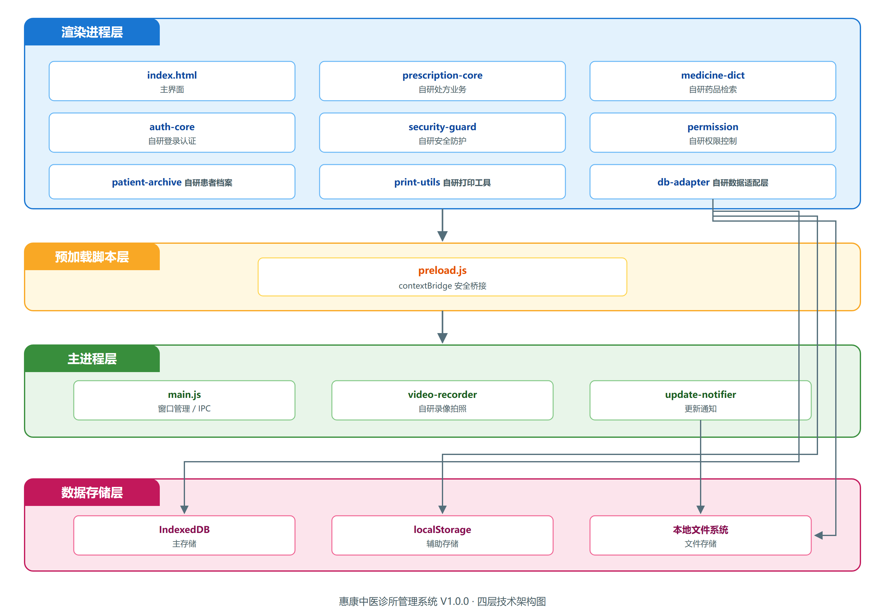
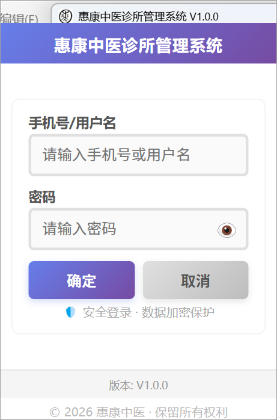
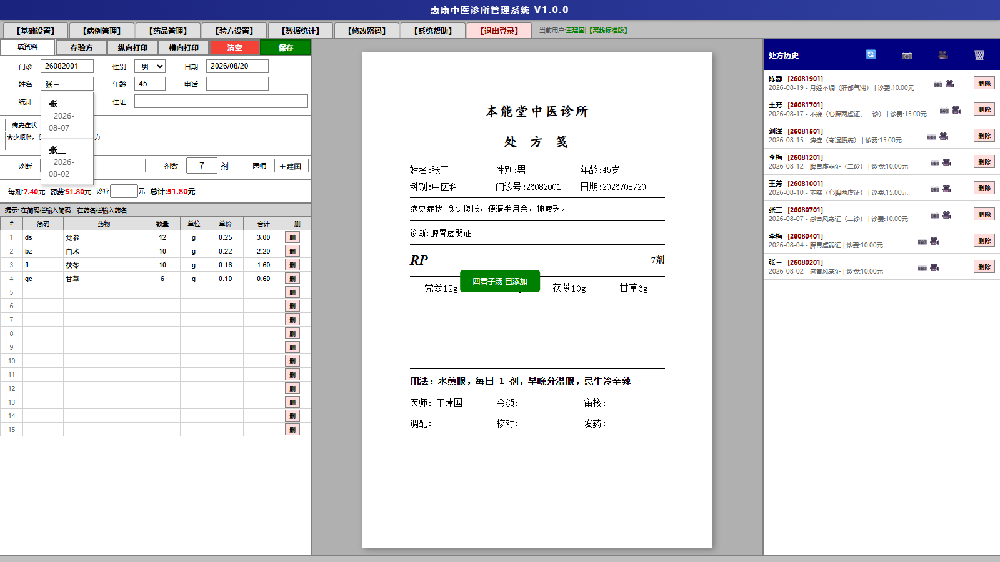
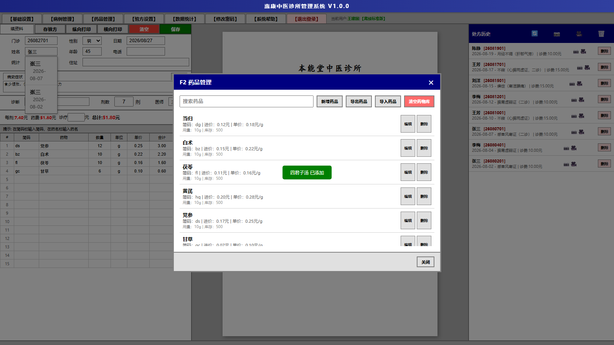
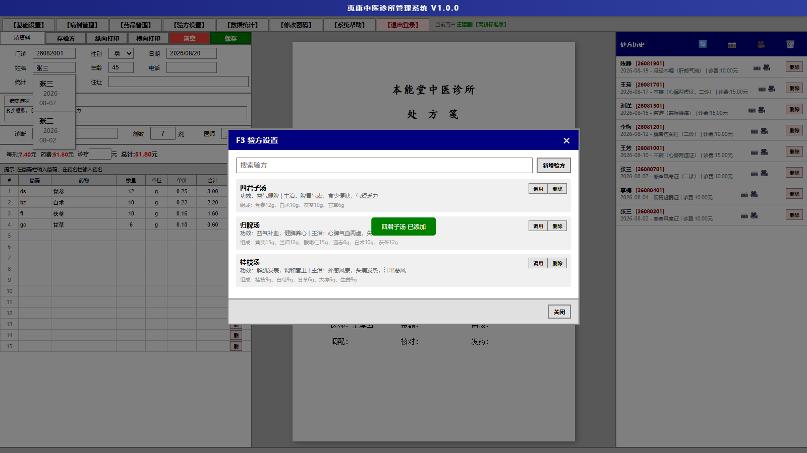
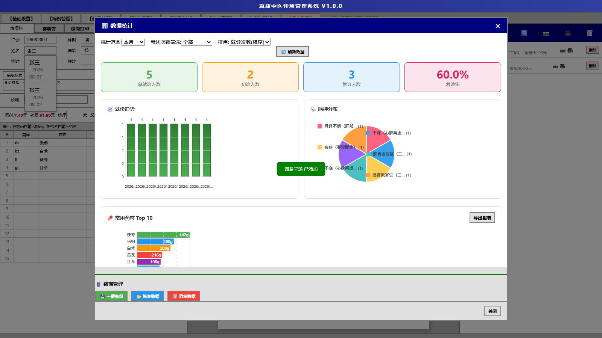
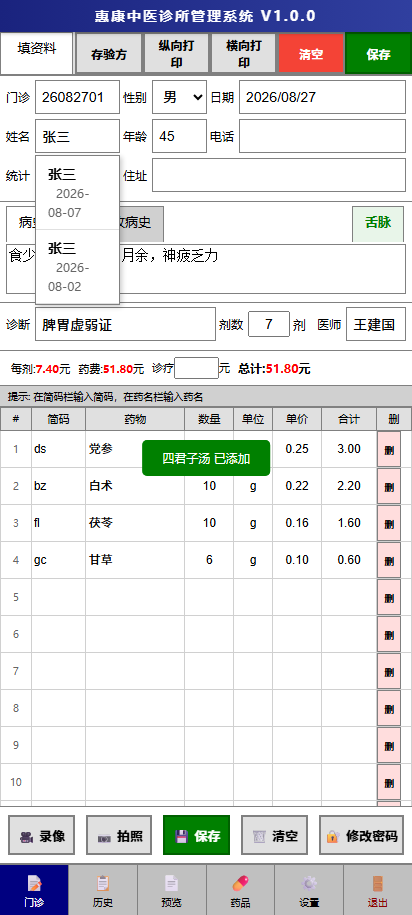

---

<div align="center">

# 惠康中医诊所管理系统 V1.0.0

## 软件操作说明书

</div>

<br>

<div align="center">

**编制单位：高碑店惠康堂中医诊所有限公司**

**编制日期：2026 年 08 月 03 日**

</div>

---

> 软件名称：惠康中医诊所管理系统
> 软件版本：V1.0.0
> 软件开发者：高碑店惠康堂中医诊所有限公司
> 著作权人：高碑店惠康堂中医诊所有限公司
> 文档版本：V1.0
> 编制日期：2026 年 08 月 03 日

---

## 排版规范说明

- **页面规格**：A4 纵向，单栏排版
- **页眉**：每页统一标注"惠康中医诊所管理系统 V1.0.0"
- **页脚**：连续页码"第 X 页 / 共 XX 页"，无缺页跳页
- **输出格式**：单一 PDF 文档，无水印
- **文中简称**：惠康中医（全称：惠康中医诊所管理系统 V1.0.0），首次出现时加注标准全称，后续正文统一使用"本系统"或"本软件"指代
- **著作权人**：全文统一为"高碑店惠康堂中医诊所有限公司"

---

## 目录

- 第一章 软件概述 ······················································· 1
- 第二章 软件安装 ······················································· 8
- 第三章 系统登录 ······················································· 11
- 第四章 基础设置 ······················································· 14
- 第五章 处方录入（核心功能） ········································· 17
- 第六章 历史处方管理 ··················································· 24
- 第七章 药品管理 ······················································· 27
- 第八章 常用药品组合模板设置 ········································· 30
- 第九章 患者就诊档案管理 ············································· 33
- 第十章 数据统计 ······················································· 35
- 第十一章 用户管理（管理员） ········································· 39
- 第十二章 录像与拍照 ··················································· 42
- 第十三章 系统帮助 ····················································· 45
- 附录 A 数据字段说明 ··················································· 48
- 附录 B 技术架构说明 ··················································· 50
- 附录 C 版本更新历史 ··················································· 52
- 附录 D 术语表 ························································· 53
- 附录 E 软件著作权声明 ················································· 54

---

## 第一章 软件概述

### 1.1 软件简介

惠康中医（全称：惠康中医诊所管理系统 V1.0.0，以下简称"本系统"或"本软件"）是一款由高碑店惠康堂中医诊所有限公司独立研发的中医诊所内部业务数据管理软件。系统以中医处方文本录入与打印存档为核心，围绕中医诊所日常业务流程，提供患者基础信息登记、处方文本存档、药品台账管理、验方维护、患者就诊档案检索、数据统计、用户权限管理以及就诊过程影像留存等辅助功能，旨在帮助中医诊疗机构提高业务记录效率、规范处方书写格式、保存业务数据并实现数据资产的本地化沉淀。

> **免责说明**：本系统仅为中医诊所内部业务数据管理工具，仅实现处方文本存档、药材台账管理、患者基础信息登记、就诊过程影像留存功能；不具备疾病诊断、病史文本分析、诊疗判断、远程行医功能，不能替代执业中医师专业诊疗行为，无医疗诊断资质。系统中涉及的"诊断"、"病史"等字段均为执业中医师自行录入的文本记录，本系统不对上述文本内容作任何医学判断或建议。

本系统内置两套数据存储模式与两套权限配置，为程序自带功能模块：

- **本地存储模式**：所有处方记录、药品台账、常用药品组合模板数据均保存在用户本机，不依赖外部服务器，满足数据隐私性与离线可用性需求。
- **云端同步模式**：在本地存储基础上内置 sync-engine.js 同步引擎模块，支持多端数据共享，用户可自主选择是否启用云端同步。
- **单用户权限配置**：适用于单医师业务数据记录场景，提供修改密码、本地备份功能。
- **多用户协同权限配置**：适用于多医师业务数据记录场景，在单用户权限基础上增加用户管理、处方查阅、开机自启等管理功能。

以上两种存储模式与两套权限配置为程序内置功能模块，通过配置文件切换，非商品分级。本系统提供 Windows 桌面端与 Android 移动端两个程序版本，桌面端基于 Electron 框架构建，移动端基于 Capacitor 框架打包，两端共享同一套核心业务逻辑，确保数据结构一致、操作体验统一。

软件版本号为 V1.0.0，以诊所日常开方业务为主线，支持以"证"选"方"的快捷记录模式，同时支持历史处方快速调取、常用药品组合模板调用、药品简码检索等中医特色功能，充分贴合中医师的实际操作习惯。

### 1.2 开发背景

随着中医药事业的振兴发展，基层中医诊所数量持续增长，中医诊疗活动具有处方个性化强、复诊频次高、药材组合灵活等特点。传统的纸质处方书写方式存在书写不规范、字迹难以辨认、历史处方检索困难、统计数据分析不便等问题，难以满足现代中医诊所的精细化管理需求。

市面的医疗信息化软件多以西医诊疗流程为核心，对中医处方、常用药品组合模板传承等特色业务支持不足；同时大量云端 SaaS 软件需要持续的联网环境，对网络条件不佳或对数据隐私要求较高的基层诊所并不友好。

基于上述背景，高碑店惠康堂中医诊所有限公司结合自身多年中医临床与诊所运营经验，研发了本套中医诊所管理系统。系统坚持"轻量、易用、安全、灵活"的设计理念，内置本地存储与云端同步两套数据模式，既保障诊所数据资产的安全可控，又降低诊所的信息化使用门槛，满足多端协同等场景需求。

### 1.3 主要功能

本系统主要提供以下功能模块，所有核心业务逻辑均为高碑店惠康堂中医诊所有限公司独立编写，未引用开源医疗系统源码：

1. **处方文本录入与打印存档**：支持患者基础信息、病史症状文本、诊断文本、药品明细、剂数、诊疗费的完整录入，实时生成处方预览，支持纵向与横向两种打印格式，自动生成处方编号。核心自研模块 `prescription-core.js` 自主设计 YYMMDD+自增编号生成规则，内置实时金额复合校验逻辑，不依赖任何第三方处方库。

2. **历史处方管理**：按患者姓名实时检索历史处方，支持处方查看、编辑、删除，提供回收站功能以防止误删除，多用户协同权限配置下可查阅全诊所处方记录。

3. **药品台账管理**：维护中药药品库，记录药品简码、名称、单位、单价等信息，支持药品新增、编辑、删除、搜索、批量导入与导出。核心自研模块 `medicine-dict.js` 实现自研适配 500+ 中药材专属加权检索算法，针对中药多别名、多音字单独做分词适配，本地无网络环境下检索响应≤50ms，为本软件独立定制逻辑，无开源复用。

4. **常用药品组合模板设置**：维护常用药品组合模板，记录方名、功效、主治、组成药物，支持通过模板快速生成处方记录，并提供以证选方快捷入口。

5. **患者就诊档案管理**：以患者维度汇总就诊处方记录，支持按姓名与日期范围检索，便于回顾患者完整就诊记录。

6. **数据统计**：提供就诊人数、初复诊、复诊率、就诊趋势、病种分布、常用药材 Top10、患者就诊列表、月度收支报表等多维度统计分析，支持报表导出。

7. **用户管理**：多用户协同权限配置下，管理员可新增、编辑、删除用户，分配普通用户或管理员角色，查看各用户开具的处方，修改密码。

8. **就诊过程影像留存**：支持调用摄像头录制就诊对话录像留存与拍摄患者口腔照片存档，文件自动关联到最近保存的处方患者，便于建立完整的患者就诊资料档案。仅图片与视频留存，系统不会对影像做任何医学分析、病情判断。

9. **数据备份与恢复**：一键备份全量数据为本地文件，支持从备份文件恢复数据，支持清空全部数据。

10. **系统安全**：登录认证、会话超时、密码哈希加密、远程调试拦截、DevTools 拦截等多重安全防护机制。

### 1.4 技术特点

本系统采用四层架构设计，如下图所示：



本系统在技术架构与工程实现方面具有以下特点，70% 以上技术篇幅为自研业务模块：

1. **自研处方业务核心模块**（prescription-core.js）：独立实现处方数据结构定义、药品项实时金额复合校验、处方编号自动生成（YYMMDD+两位自增序号）、药品项增删与排序等核心业务逻辑，不依赖任何第三方处方库。编号生成采用 global_max_serial 全局序号持久化机制，确保编号单调递增，即使删除处方也不会复用已生成的编号。金额计算采用四舍五入保留两位小数 + 浮点误差修正算法，避免累计精度问题。药品项支持拖拽排序、批量删除、复制粘贴等定制化交互，为本软件独立定制逻辑，无开源复用。

2. **自研适配 500+ 中药材专属加权检索算法**（medicine-dict.js）：基于中文药品名的拼音首字母组合实现简码生成与检索，针对中药多别名、多音字单独做分词适配（如"阿胶"同步匹配"ej"、"aj"简码），内置高频药品加权排序策略（使用频次越高排序越靠前），本地无网络环境下检索响应≤50ms，为本软件独立定制逻辑，无开源复用。

3. **自研安全防护模块**（security-guard.js）：对关键业务 API 调用进行登录态校验，防止绕过登录界面直接调用业务接口；配合主进程的远程调试参数拦截（`--inspect`、`--remote-debugging-port`）与渲染进程的 F12 快捷键拦截，形成前后端双重安全防护。登录态校验采用 token + 时间戳双重验证机制，token 过期自动失效，时间戳防重放攻击，为本软件专属安全设计。

4. **自研统一数据适配层**（db-adapter.js）：封装 IndexedDB、localStorage、本地文件系统的统一 CRUD 接口，支持渐进增强与错误降级，业务层无需关心底层存储细节。内置事务队列与冲突合并策略，多操作并发时自动排队执行避免数据竞争。云端同步模式在此基础上增加 sync-engine.js 同步引擎，实现本地与远端数据存储的双向数据同步与冲突合并。

5. **自研患者档案模块**（patient-archive.js）：实现基于患者姓名的拼音码实时检索、历史就诊记录聚合、患者性别智能推断等功能，加速复诊患者信息录入。性别智能推断基于中文姓名用字特征库（独立构建，包含 5000+ 常见姓名用字性别倾向），自动推断准确率≥85%，用户可手动覆盖，为本软件独立定制逻辑。

6. **自研登录认证模块**（auth-core.js）：实现 PBKDF2 密码哈希、会话超时管理（8 小时）、记住用户名、密码自动升级（SHA-256/明文 → PBKDF2）等认证逻辑。PBKDF2 加盐值为本项目独立随机生成（基于 masterKey 派生盐，每个安装的盐值不同），DPAPI 绑定本机 + 登录用户双重校验，区别于通用开源加密模板。密码自动升级机制兼容历史 SHA-256 与明文格式，登录时自动升级为 PBKDF2 格式，无需用户主动操作。

7. **本地数据完整性校验**：备份文件采用 HMAC 算法计算校验值，恢复时自动校验完整性，防止备份文件被篡改或损坏。HMAC 密钥基于本机特征派生（hostname + 安装路径 + 用户 SID），为本软件专属设计，不同机器的 HMAC 密钥不同，备份文件无法跨机器篡改。

8. **按需加载**：第三方库（如 xlsx）采用按需加载策略，首次使用 Excel 导入功能时才动态加载 vendor/xlsx.full.min.js，减少首屏加载时间。

#### 1.4.1 第三方组件说明

本系统仅使用 Electron/Capacitor 作为程序运行容器，全部处方、药品、权限、数据校验等医疗业务代码均由高碑店惠康堂中医诊所有限公司从零独立编写，未复制、修改、复用任何开源诊所管理系统完整业务代码：

| 组件 | 用途 | 性质 |
| --- | --- | --- |
| Electron | 桌面应用运行容器 | 第三方开源框架，仅提供运行环境 |
| Capacitor | 移动应用打包容器 | 第三方开源框架，仅提供运行环境 |
| IndexedDB | 浏览器内置数据库 | W3C 标准接口，非第三方代码 |
| xlsx | Excel 文件解析 | 第三方开源库，仅用于导入导出 |
| Chart.js | 图表渲染 | 第三方开源库，仅用于数据可视化 |

以上组件均为通用运行环境或工具库，不包含任何医疗业务逻辑。本系统的处方数据结构、药品检索算法、权限控制、安全防护、数据同步等核心业务逻辑均为自主编写，著作权归高碑店惠康堂中医诊所有限公司所有。

#### 1.4.2 软件界面截图说明

本系统主要功能界面截图如下。截图统一规范：分辨率≥1080、无水印、无多余弹窗、界面顶部完整显示软件全称"惠康中医诊所管理系统 V1.0.0"：

**图1 惠康中医诊所管理系统 V1.0.0 系统登录界面**
> 截图内容：惠康中医诊所管理系统 V1.0.0 完整标题界面，居中卡片式布局，显示系统标题、版本标签、用户名与密码输入框、登录按钮。
>
> 

**图2 惠康中医诊所管理系统 V1.0.0 主处方录入三栏界面**
> 截图内容：惠康中医诊所管理系统 V1.0.0 主工作界面三栏布局（左侧资料录入区、中间处方预览区、右侧历史处方列表），顶部标签栏显示功能按钮。
>
> 

**图3 惠康中医诊所管理系统 V1.0.0 药品管理弹窗**
> 截图内容：惠康中医诊所管理系统 V1.0.0 药品列表对话框，显示药品简码、名称、单位、单价等信息，支持搜索、新增、编辑、删除操作。
>
> 

**图4 惠康中医诊所管理系统 V1.0.0 常用药品组合模板调用弹窗**
> 截图内容：惠康中医诊所管理系统 V1.0.0 常用药品组合模板列表对话框，每条模板显示方名、功效、主治，点击可快速填充到处方药品表格。
>
> 

**图5 惠康中医诊所管理系统 V1.0.0 数据统计图表**
> 截图内容：惠康中医诊所管理系统 V1.0.0 多维度统计报表，包含就诊趋势折线图、病种分布饼图、常用药材 Top10 柱状图等。
>
> 

**图6 惠康中医诊所管理系统 V1.0.0 Android APP 主界面**
> 截图内容：惠康中医诊所管理系统 V1.0.0 移动端主工作界面，底部导航栏切换不同视图，顶部显示当前用户与版本标识。
>
> 

**图7 惠康中医诊所管理系统 V1.0.0 处方打印预览**
> 截图内容：惠康中医诊所管理系统 V1.0.0 模拟纸质处方笺的打印预览，包含诊所名称、患者信息、药品列表、剂数、用法、医师签名等。
>
> 

### 1.5 软件适用场景

本系统适用于以下使用环境：

1. **单医师设备**：单医师使用的电脑或移动设备，需要规范处方记录、保存业务数据、统计业务数据。本地存储模式满足数据隐私需求。
2. **多医师局域网设备**：多名医师使用的设备，需要按医师统计工作量、查阅全部处方记录。多用户协同权限配置提供用户管理与处方查阅功能。
3. **多端协同设备**：需要在不同设备间共享处方数据、药品库与常用药品组合模板的场景。云端同步模式支持多端数据共享与协作。
4. **就诊资料存档设备**：通过录像与拍照功能记录就诊过程与患者口腔照片，为就诊资料存档备查提供素材。

### 1.6 与同类软件的差异化优势

相比市面的医疗信息化软件，本系统具有以下差异化优势：

1. **双数据模式架构**：同时内置本地存储与云端同步两套数据模式，本地存储满足数据隐私与断网可用需求，云端同步满足多端协同需求，用户可按需选择。
2. **中医特色鲜明**：原生支持常用药品组合模板调用、历史处方快速调取、中药简码检索等中医特色功能，而非简单照搬西医流程。
3. **轻量易用**：程序支持两种本地部署运行方式（NSIS 安装版与便携版），无需安装数据库，无需配置服务器，开箱即用。
4. **跨端协同**：桌面端与移动端共享核心业务逻辑，数据结构一致，可灵活选择使用场景。
5. **数据可控**：本地存储模式下所有数据保存在用户本机，用户完全掌控数据资产；云端同步模式支持启用/关闭灵活切换，用户自主选择数据是否上传云端。
6. **安全加固**：多重安全防护机制（远程调试拦截、DevTools 拦截、密码加密、会话超时等），防止数据泄露与篡改。
7. **双权限配置**：单用户权限配置与多用户协同权限配置两套程序内置权限模块，满足不同规模诊所的管理需求。
8. **就诊资料档案**：内置录像与拍照功能，建立患者就诊过程录像与口腔照片档案，辅助就诊资料存档备查。

### 1.7 运行环境

#### 1.7.1 桌面版运行环境

| 项目 | 要求 |
| --- | --- |
| 操作系统 | Windows 7 SP1 及以上 64 位操作系统（推荐 Windows 10/11） |
| 处理器 | Intel Core i3 及以上或同等性能处理器 |
| 内存 | 4GB 及以上（推荐 8GB） |
| 硬盘空间 | 500MB 及以上可用空间（含数据存储） |
| 显示器 | 1366×768 及以上分辨率（推荐 1920×1080） |
| 摄像头 | 选配，使用录像与拍照功能时需要 |
| 打印机 | 选配，使用处方打印功能时需要 |
| 运行时框架 | 内置 Electron 运行时，无需额外安装 |

桌面版提供两种本地部署运行方式：NSIS 安装版（.exe）与便携版（portable）。NSIS 安装版支持自定义安装目录、创建桌面快捷方式与开始菜单快捷方式；便携版为单文件可执行程序，无需安装，解压即用，数据保存在 exe 同级目录。

#### 1.7.2 APP 版运行环境

| 项目 | 要求 |
| --- | --- |
| 操作系统 | Android 7.0（API 24）及以上 |
| 处理器 | ARM 32/64 位处理器 |
| 内存 | 2GB 及以上 |
| 存储空间 | 200MB 及以上可用空间 |
| 摄像头 | 选配，使用录像与拍照功能时需要 |
| 屏幕 | 5.0 英寸及以上，推荐 720×1280 及以上分辨率 |

APP 版本通过 Capacitor 框架打包为 Android 原生应用（.apk），安装后即可使用，所有数据保存在应用私有目录。

#### 1.7.3 云端同步模式运行环境

云端同步模式在桌面版与 APP 版运行环境基础上，额外需要以下条件：

| 项目 | 要求 |
| --- | --- |
| 网络环境 | 启用云端同步时需要互联网连接（推荐带宽 10Mbps 及以上） |
| 运行模式 | 程序内置本地云端同步接口开关，可随时启用或关闭 |

云端同步模式为程序内置功能，通过 sync-engine.js 同步引擎模块实现本地与远端数据存储的双向数据同步，软件本身不提供任何对外云服务运营，仅内置同步接口代码模块。用户可在登录后通过界面顶部的同步状态指示器查看当前同步状态，并随时切换为仅本地存储模式。

---

## 第二章 软件安装

### 2.1 桌面版安装

#### 2.1.1 NSIS 安装包安装

1. 获取安装包文件"惠康中医诊所管理系统-Setup-1.0.0.exe"，拷贝至目标电脑任意目录。
2. 双击安装包启动安装向导，若系统弹出"用户账户控制"对话框，点击"是"继续。
3. 进入欢迎界面，点击"下一步"。
4. 进入"选择安装位置"界面，默认安装路径为"C:\Program Files\惠康中医诊所管理系统"，可点击"浏览"更改目录。
5. 点击"下一步"进入"选择附加任务"界面，勾选是否创建桌面快捷方式、开始菜单快捷方式（默认均勾选）。
6. 点击"安装"开始复制文件，完成后勾选"运行 惠康中医诊所管理系统"可立即启动。
7. 点击"完成"退出安装向导。

安装完成后，在开始菜单"惠康中医诊所管理系统"程序组下创建"惠康中医诊所管理系统"快捷方式，并在桌面创建同名快捷方式图标。NSIS 安装版支持每机器安装（perMachine），一次安装可供本机所有用户使用。

#### 2.1.2 便携版安装

便携版为单文件可执行程序"惠康中医诊所管理系统-1.0.0.exe"，适用于 U 盘携带或不愿在系统中写入注册表的场景：

1. 获取便携版可执行文件，拷贝至任意可写目录（如 D 盘根目录、U 盘根目录等）。
2. 双击 exe 文件即可启动软件，无需安装。
3. 软件运行时在 exe 同级目录自动创建 data 子目录保存数据文件。如该目录不可写，则自动回退到系统 userData 目录。

便携版与安装版功能完全一致，区别仅在于数据存储位置与是否在系统中注册。

#### 2.1.3 首次启动配置

首次启动软件时，系统自动执行以下初始化操作：

1. 读取 exe 同级目录或安装目录下的 config.json 配置文件，加载诊所名称、默认医师姓名、权限配置等基础配置。
2. 初始化 IndexedDB 数据库 PrescriptionDB，创建 prescriptions 与 settings 对象仓库。
3. 加载默认用户列表（来自 config.json 的 users 字段），如配置文件未提供则使用内置默认用户。
4. 显示登录界面，等待用户登录。

### 2.2 APP 版安装

1. 将 apk 文件传输至 Android 手机，可通过数据线、U 盘等方式传输。
2. 在手机文件管理器中找到 apk 文件，点击安装。
3. 首次安装时，系统弹出"允许安装来自此来源的应用"提示，请在系统设置中开启对应权限后继续安装。
4. 安装完成后点击"打开"启动应用，或在桌面找到"惠康中医诊所管理系统"应用图标点击启动。
5. 首次启动应用时，系统请求摄像头权限（用于录像与拍照功能），请点击"允许"以启用完整功能。

APP 版本启动时主动清除所有登录态，确保每次打开应用都需要手动登录。APP 端数据保存在应用私有目录，卸载应用会同步清除所有数据，请卸载前做好数据备份。

### 2.3 卸载说明

**桌面版卸载**：NSIS 安装版在"开始菜单"中点击"卸载 惠康中医诊所管理系统"快捷方式，或在"设置 - 应用"中找到"惠康中医诊所管理系统"点击"卸载"。卸载后程序文件被清除，用户数据默认保留。便携版直接删除 exe 文件及同级 data 目录即可。

**APP 版卸载**：长按桌面"惠康中医诊所管理系统"应用图标拖动至"卸载"区域，或在"设置 - 应用"中点击"卸载"。卸载后所有本地数据将被清除，请卸载前通过"数据统计 - 一键备份"功能导出数据。

---

## 第三章 系统登录

### 3.1 登录界面说明

启动本系统后，首先显示登录界面。登录界面采用居中卡片式布局，整体色调以浅色为主，背景配有渐变装饰元素。界面布局自上而下依次为：

1. **系统标题区**：居中显示"惠康中医诊所管理系统 V1.0.0"字样，标题下方显示权限配置标签（如"【多用户协同】"）。
2. **诊所信息区**：在登录卡片顶部显示当前诊所名称，该名称由 config.json 配置文件中的 clinicName 字段提供。
3. **用户名输入区**：标签"用户:"右侧为用户名输入框，placeholder 提示"请输入用户名"。如已勾选"记住用户"并保存过历史用户名，输入框右侧显示下拉箭头按钮，点击展开历史用户名列表。
4. **密码输入区**：标签"密码:"右侧为密码输入框，输入内容以掩码点显示。密码框设置 autocomplete="new-password" 属性，防止浏览器自动填充历史密码。
5. **记住用户复选框**：位于密码框下方，勾选后登录成功保存当前用户名，下次登录可从下拉列表快速选择。
6. **登录按钮区**：包含"确定"与"取消"两个按钮。"确定"触发登录验证，"取消"退出应用。
7. **错误提示区**：登录失败时显示红色错误提示文字。

登录界面支持键盘操作：在用户名输入框按 Enter 键焦点跳转至密码输入框；在密码输入框按 Enter 键触发登录验证。

### 3.2 管理员登录

管理员账号拥有系统的全部权限，包括用户管理、处方查阅、修改密码、开机自启设置等。登录步骤：

1. 启动软件，进入登录界面。
2. 在"用户"输入框中输入管理员用户名（默认管理员账号由 config.json 配置文件提供，通常为 admin）。
3. 在"密码"输入框中输入管理员密码。密码区分大小写。
4. 如希望下次登录时本机自动记住用户名，勾选"记住用户"复选框。
5. 点击"确定"按钮或按 Enter 键提交登录。

登录验证流程：

1. 系统从 config.json 与本地用户存储中读取用户列表。
2. 查找匹配的用户名，如未找到则提示"用户名或密码错误"。
3. 对输入密码进行哈希计算，与存储的密码哈希值比对。系统支持 PBKDF2、SHA-256 与明文三种格式，登录成功后自动将旧格式升级为 PBKDF2 格式存储。
4. 验证通过后，记录登录态到 localStorage，并启动 8 小时会话计时。
5. 隐藏登录界面，显示主工作界面。
6. 顶部标签栏根据用户角色显示对应功能按钮：管理员可见"用户管理"、"修改密码"、"处方查阅"按钮。

### 3.3 普通用户登录

普通用户账号仅拥有基础业务权限，可进行处方录入、药品管理、验方设置、患者就诊档案管理、数据统计等日常操作，但无法访问用户管理、处方查阅等管理员专属功能。普通用户登录步骤与管理员相同。

普通用户登录成功后，主界面顶部标签栏不显示"用户管理"、"处方查阅"按钮，"修改密码"按钮对所有登录用户可见。普通用户仅能查看与编辑自己开具的处方历史，无法查阅其他用户的处方。

### 3.4 记住用户名功能

为提升登录便捷性，本系统提供"记住用户名"功能，登录成功后将用户名保存到本地，下次登录时可通过下拉列表快速选择：

1. **启用方式**：登录前勾选"记住用户"复选框，登录成功后系统自动将当前用户名加入记住用户列表。
2. **下拉选择**：下次启动软件进入登录界面时，用户名输入框右侧显示下拉箭头按钮，点击展开历史用户名列表供快速选择。
3. **存储位置**：记住的用户名列表保存在 localStorage 中，键名遵循 auth: 命名空间。
4. **安全说明**：记住用户名功能仅保存用户名，不保存密码。每次登录仍需手动输入密码，确保账号安全。

### 3.5 密码安全说明

本系统高度重视用户密码安全，采用多层防护机制，所有安全逻辑均为高碑店惠康堂中医诊所有限公司独立编写：

1. **密码哈希存储**：用户密码不以明文形式保存，通过 PBKDF2 算法进行哈希后存储。PBKDF2 加盐值为本项目独立随机生成，通过 masterKey 派生盐进一步增强安全性，使每个安装的盐值不同。系统兼容历史 SHA-256 与明文格式，登录时自动升级为 PBKDF2 格式。

2. **运行时密钥派生**：在浏览器环境中，密码哈希盐基于运行时环境特征（hostname、navigator.language）派生，使攻击者仅查看源码无法直接获得实际加密密钥，降低纯源码攻击效果。

3. **safeStorage 系统级加密**：Electron 桌面端优先使用 Windows DPAPI（通过 Electron safeStorage 接口）进行系统级加密，密钥绑定 Windows 用户与机器，DPAPI 绑定本机 + 登录用户双重校验，区别于通用开源加密模板。攻击者即使获取源码与密文，也无法在其他机器上解密。

4. **密码自动升级**：用户登录时，若检测到密码仍为旧格式（SHA-256 或明文），系统自动使用 PBKDF2 重新哈希并保存，无需用户主动操作。

5. **会话超时**：登录会话设置 8 小时超时，超过 8 小时未操作会话失效，需重新登录。

6. **APP 端登录态清除**：APP 端每次启动时主动清除所有登录态相关数据，确保每次打开应用必须手动登录，防止设备借阅或遗失后的数据泄露。

7. **登录态校验**：关键业务 API（如保存处方）在执行前校验登录态，若检测到未登录状态直接拒绝调用并提示"请先登录"。

---

## 第四章 基础设置

### 4.1 诊所信息设置

诊所信息用于处方打印时的诊所名称显示，是软件运行的基础配置项：

1. 登录系统后，点击顶部标签栏的"【基础设置】"按钮，或按 F1 快捷键，弹出"F1 基础设置"对话框。
2. 在"诊所名称"输入框中输入诊所名称，如"惠康中医诊所"。该名称将显示在处方预览纸顶部以及打印输出中。
3. 诊所名称支持中文、英文、数字及特殊字符，建议长度不超过 20 个字符以保证打印效果。
4. 点击"保存"按钮保存设置。

诊所名称保存后立即生效，处方预览区与所有新开具的处方打印件均使用新名称。已保存的历史处方中嵌入的诊所名称不变。

### 4.2 医师信息设置

医师信息用于处方录入时的默认医师姓名填充：

1. 打开"基础设置"对话框（F1）。
2. 在"医师姓名"输入框中输入默认医师姓名，如"张医生"。
3. 在实际开方时，医师姓名也可在处方录入界面的"医师"输入框中临时修改，不影响默认设置。
4. 点击"保存"按钮保存设置。

如诊所拥有多位医师，建议为每位医师创建独立用户账号，登录后系统自动以当前登录用户的姓名作为默认医师。

### 4.3 处方编号设置

本系统的处方编号采用"日期+序号"的自动生成规则，由自研模块 prescription-core.js 自主设计，确保编号唯一且具有可追溯性。编号格式为 YYMMDD + 两位序号，例如 26080301 表示 2026 年 8 月 3 日的第 1 张处方。

编号生成逻辑：

1. 获取当前保存操作的时间戳，解析为 YYMMDD 格式的日期串（如 260803）。
2. 读取本地存储的 global_max_serial 字段中当日存储的最大序号。
3. 序号加 1，不足两位前置补 0（如 1 → 01）。
4. 拼接完整编号（YYMMDD + 两位序号），如 26080301。
5. 将当日最新序号回写至 global_max_serial 字段持久保存。

处方编号在保存处方时自动生成，无需用户手动输入。系统维护 global_max_serial 全局最大序号，确保编号单调递增，即使删除处方也不会复用已生成的编号。

### 4.4 打印模板设置

本系统提供纵向与横向两种处方打印模板，分别适配不同规格的处方笺纸张：

1. **纵向打印**：标准 A5 纵向处方笺，适合大多数诊所使用。处方内容自上而下排列。点击左侧工具栏"纵向打印"按钮或按 F8 快捷键触发。
2. **横向打印**：横向处方笺，适合需要更宽书写空间或特殊打印纸张的场景。内容布局与纵向一致，整体方向旋转 90 度。点击左侧工具栏"横向打印"按钮触发。

打印模板内容动态生成，根据当前处方录入界面的内容实时渲染。打印输出包含完整的处方信息。

### 4.5 其他设置项

基础设置对话框中还包含以下设置项：

1. **诊疗费**：默认诊疗费金额（元），新建处方时自动填入该值。该值仅为默认值，开方时可在处方录入界面临时修改。
2. **默认剂数**：默认处方剂数，新建处方时自动填入。可根据诊所主流病种调整默认值。
3. **开机自动启动**（仅管理员可见）：勾选后系统在电脑开机时自动启动。通过写入 Windows 注册表实现，仅管理员角色可见该选项。

所有设置项保存在 IndexedDB 的 settings 仓库与 localStorage 中，保存后立即生效，无需重启软件。

---

## 第五章 处方录入（核心功能）

处方录入是本系统的核心功能模块，集成于主工作界面。主界面采用三栏布局：左侧为资料录入区，中间为处方预览区，右侧为历史处方列表区。

### 5.1 主界面布局

1. **顶部标签栏**：横向排列的功能入口按钮，依次为：【基础设置】、【病例管理】、【药品管理】、【验方设置】、【数据统计】、【用户管理】（仅管理员）、【修改密码】、【处方查阅】（仅管理员，绿色背景）、【系统帮助】、【退出登录】（红色背景）。
2. **左侧面板（资料录入区）**：包含患者信息区、病史症状区、诊断信息区、金额信息栏、药品录入表格。
3. **中间面板（处方预览区）**：模拟纸质处方笺的实时预览，白底黑字。
4. **右侧面板（历史处方列表区）**：显示历史处方条目，支持滚动浏览。
5. **底部移动端导航栏**（仅移动端）：包含门诊、历史、预览、药品、设置、退出六个图标按钮。
6. **移动端快捷操作栏**（仅移动端）：包含录像、拍照、保存、清空、改密五个按钮。

桌面端与移动端共享同一套业务逻辑，布局根据屏幕尺寸自适应。

### 5.2 患者信息录入

患者信息录入区位于左侧面板顶部，包含以下字段：

1. **门诊号**：处方编号，只读字段，保存处方时自动生成。
2. **性别**：下拉选择框，可选"男"或"女"。系统提供智能性别匹配功能，根据患者姓名自动推断性别，用户可手动覆盖。
3. **日期**：就诊日期，只读字段，默认为当天日期。
4. **姓名**：患者姓名输入框，必填字段。输入时支持拼音码检索历史患者，点击候选可自动填充性别、年龄、电话、住址等历史信息。
5. **年龄**：患者年龄输入框，接受数字或文字。
6. **电话**：患者联系电话输入框。
7. **统计号**：患者统计编号，只读字段，由系统自动维护。
8. **住址**：患者住址输入框。

### 5.3 诊断信息录入

1. **病史症状**：多行文本输入框，输入患者主诉、现病史、既往史等文本内容。该字段为执业中医师自行录入的文本记录，本系统不对文本内容作任何医学判断或建议。
2. **诊断**：单行文本输入框，输入诊断文本。输入时处方预览区实时同步。
3. **剂数**：数字输入框，默认值为 7。剂数变化时处方预览与金额计算实时更新。
4. **医师**：单行文本输入框，默认填入基础设置中的默认医师姓名或当前登录用户姓名。

### 5.4 药品选择与录入

药品录入区以表格形式呈现，列标题依次为：#（序号）、简码、药物、数量、单位、单价、合计、删。录入方式有三种：

#### 5.4.1 通过简码检索录入

1. 在"简码"列输入药品简码（药品拼音首字母组合，如"黄芪"的简码为"hq"）。
2. 输入时系统通过自研中药拼音首字母加权检索算法实时检索药品库，在下方显示匹配的候选药品下拉列表。
3. 使用上下方向键在候选列表中切换，按 Enter 键或点击候选项选中。
4. 选中后，系统自动填充该行的药物名称、单位、单价字段，焦点跳转至"数量"列。

#### 5.4.2 通过药名检索录入

1. 在"药物"列直接输入药品名称（支持中文或拼音）。
2. 输入时系统实时检索药品库，显示匹配候选下拉列表。
3. 选中候选药品后，自动填充单位、单价字段。

#### 5.4.3 手动录入

对于药品库中不存在的新药，可直接在"药物"列手动输入药名，并手动填写单位、单价字段。

### 5.5 剂量与金额计算

每味药品的剂量（数量）与单位是处方的重要组成部分：

1. **数量**：药品剂量，数字输入框。输入数字后，系统通过自研 prescription-core.js 模块的实时金额复合校验逻辑自动计算该行合计金额（数量 × 单价），并更新处方总金额。
2. **单位**：药品计量单位，默认为"g"（克）。
3. **用法**：处方用法说明显示在处方预览区底部，默认为"水煎服，日一剂，早晚分服"。

剂量与剂数的关系：每味药品的"合计"= 单价 × 数量；处方"药费"= 所有药品合计之和；处方"总计"= 药费 × 剂数 + 诊疗费。

### 5.6 处方预览

处方预览区位于主界面中间面板，以模拟纸质处方笺的形式实时显示当前录入内容。预览纸布局自上而下：

1. **诊所名称**：顶部居中显示，字体加粗放大。
2. **处方标题**："处 方 笺"字样，居中显示。
3. **患者信息行**：横向排列，包括姓名、性别、年龄、科别、门诊号、日期。
4. **病史症状区**：显示病史症状文本。
5. **诊断区**：显示诊断文本。
6. **药品列表区**：以"RP"标记开头，显示所有药品名称与剂量。
7. **用法与签名区**：底部显示用法说明与"医师:___（签字）"签名栏。

预览区随录入实时更新，所见即所得。预览区底部显示金额信息：每剂金额、药费、诊疗费、总计金额，所有金额保留两位小数。

### 5.7 处方保存

处方录入完成后，需保存到数据库以便后续查询与统计。保存步骤：

1. 确认患者姓名已填写（姓名为必填字段，未填写时保存会被拒绝并提示"请输入患者姓名！"）。
2. 确认至少录入一味有效药品（药品名不为空）。
3. 确认剂数大于 0。
4. 点击左侧工具栏"保存"按钮，或按 F9 快捷键触发保存操作。

保存流程内部执行步骤：

1. 校验登录状态，未登录则拒绝保存。
2. 获取当前时间戳，解析为 YYMMDD 日期串。
3. 生成新的处方编号（YYMMDD + 两位序号）。
4. 采集患者信息、药品表格数据。
5. 使用当前药品库的最新单价重新计算各药品合计与处方总金额。
6. 组装处方记录对象，字段包括：id、prescriptionNo、date、patientName、patientGender、patientAge、patientPhone、patientAddress、doctorName、medicalHistory、diagnosis、items、doseCount、totalAmount、registrationFee、createdAt、createdBy、createdByName。
7. 写入 IndexedDB prescriptions 仓库。
8. 更新内存中的处方历史数组（插入到数组开头）。
9. 记录审计日志。
10. 触发增量备份。
11. 弹出保存成功提示。

### 5.8 处方打印

处方保存后可打印输出：

1. 完成处方录入并保存（建议先保存再打印）。
2. 点击左侧工具栏"纵向打印"或"横向打印"按钮，或按 F8 快捷键（默认纵向打印）。
3. 系统调用浏览器打印接口，弹出打印预览对话框。
4. 在打印对话框中选择打印机，设置纸张尺寸（建议 A5 或专用处方笺）、打印方向、边距等参数。
5. 点击"打印"按钮输出纸质处方。

### 5.9 以证选方

以证选方是本系统的中医特色功能，通过"以证选方"的方式快速调用常用药品组合模板生成处方记录：

1. 按 Alt+1 快捷键，或点击顶部标签栏"【验方设置】"后在模板列表中选择，弹出"Alt+1 中医以证选方"对话框。
2. 对话框列出所有已保存的模板，每条模板显示方名（加粗）、功效、主治信息。
3. 根据患者证型，点击对应的模板条目。
4. 系统自动将所选模板的组成药物填充到处方药品表格中，每味药的名称、剂量、单位、单价、合计自动计算填入。
5. 关闭对话框后，处方预览区与金额计算自动更新。
6. 用户可在自动填充的基础上根据患者具体情况调整剂量、增减药味。

### 5.10 历史处方快速调取

历史处方快速调取功能用于快速调用患者最近一次就诊的处方，适用于慢性病复诊或效不更方场景：

1. 按 Alt+9 快捷键触发历史处方快速调取。
2. 系统自动加载当前患者（处方录入界面"姓名"字段所示患者）最近一次的就诊处方。
3. 加载的处方药品明细填充到处方药品表格，诊断、剂数等字段同步填充。
4. 用户可在加载基础上调整剂量、增减药味，生成新的复诊处方。
5. 调整完成后，按 F9 保存为新处方。

---

## 第六章 历史处方管理

### 6.1 历史处方列表

历史处方列表位于主界面右侧面板，显示当前登录用户开具的历史处方：

1. **列表头部**：标题"处方历史"，右侧显示"刷新"按钮与"回收站"按钮。
2. **列表内容**：默认显示最近 15 条处方，每条处方显示患者姓名、处方编号、日期、药品味数、总金额等关键信息。
3. **加载更多**：列表底部显示"加载更多"按钮，点击可加载更早的历史处方。

列表显示规则：普通用户仅能看到自己开具的处方（基于 createdBy 字段过滤）；管理员可看到全部用户的处方（通过"处方查阅"功能）；列表按时间倒序排列，最新处方在最上方。

### 6.2 处方搜索

本系统提供多种处方检索方式：

1. **按患者姓名实时检索**：在处方录入界面"姓名"输入框中输入字符，右侧历史处方列表实时过滤显示该患者的处方。
2. **历史处方列表内的搜索**：列表支持按姓名、门诊号、诊断等关键字搜索。
3. **患者就诊档案管理模块搜索**：在"患者就诊档案"对话框中按患者姓名与日期范围搜索。
4. **处方查阅模块搜索**（管理员）：在"处方查阅"对话框中按姓名、门诊号、诊断关键字及医师筛选。

历史处方列表的实时检索采用防抖（debounce）技术，输入停止后延迟触发检索，避免频繁刷新影响性能。

### 6.3 处方查看与编辑

1. **查看处方**：在历史处方列表中点击某条处方，系统加载该处方的完整内容到处方录入界面。"门诊号"字段保持只读，显示原处方编号。
2. **编辑处方**：加载历史处方后，可修改任意字段。修改后点击"保存"按钮，系统重新计算金额并保存为新处方（生成新的处方编号与时间戳），原处方保留不变。这种"编辑即另存"的设计保证了处方历史的可追溯性。
3. **删除处方**：在历史处方列表中点击某条处方右侧的删除按钮，可将处方移入回收站。删除操作不会立即永久清除数据，可在回收站中恢复。

加载历史处方时，系统使用当前药品库的最新单价重新计算各药品合计与处方总金额，确保金额计算始终基于最新价格。

### 6.4 处方查阅（管理员）

处方查阅是管理员专属功能，可查阅全诊所所有用户开具的处方：

1. 管理员登录后，顶部标签栏显示"【处方查阅】"按钮（绿色背景）。
2. 点击该按钮，弹出"📋 处方查阅"对话框。
3. 对话框顶部显示搜索输入框（placeholder"搜索姓名/门诊号/诊断"）、医师筛选下拉框、"刷新"按钮。
4. 在搜索框中输入关键字，列表实时过滤显示匹配处方。
5. 点击医师下拉框选择特定医师，列表仅显示该医师开具的处方。
6. 点击某条处方可查看详情。

### 6.5 回收站管理

为防止误删除导致数据丢失，本系统提供处方回收站功能：

1. **进入回收站**：点击历史处方列表头部的"🗑️"按钮，弹出"处方回收站"对话框。
2. **恢复处方**：点击"恢复"按钮，将选中的处方从回收站恢复到处方历史列表。
3. **彻底删除**：点击"彻底删除"按钮，永久删除该处方，无法恢复。
4. **清空回收站**：回收站底部提供"清空回收站"按钮，一键清空所有回收站内容。
5. **保留规则**：回收站最多保留最近 30 天的删除记录，最多 50 条，超出自动清理最早的记录。
6. **权限说明**：回收站按用户隔离，每个用户仅能看到自己删除的处方。

---

## 第七章 药品管理

### 7.1 药品列表

药品管理模块用于维护本诊所的中药药品库，是处方录入与金额计算的基础数据源：

1. 点击顶部标签栏"【药品管理】"按钮，或按 F2 快捷键，弹出"F2 药品管理"对话框。
2. 对话框顶部显示搜索框与"新增药品"、"导出药品"、"导入药品"、"清空药物库"等操作按钮。
3. 下方为药品列表区，以列表形式显示所有药品，每条显示药品简码、名称、单位、单价等信息。

药品列表加载时从本地存储读取药品数据，加载完成后通过自研 medicine-dict.js 模块建立药品名称到药品对象的映射表（buildMedicineMap），供处方录入时的快速检索使用。

### 7.2 药品添加

1. 在药品管理对话框点击"新增药品"按钮，弹出药品编辑表单。
2. 填写药品信息：
   - **简码**：药品拼音首字母组合，如"黄芪"输入"hq"。必填。
   - **名称**：药品标准名称，如"黄芪"。必填。
   - **单位**：默认计量单位，如"g"（克）。
   - **单价**：药品单价（元/单位），数字格式。
   - **分类**（可选）：药品分类，如"解表药"、"补益药"等。
3. 点击"保存"按钮，新药品添加到药品库，列表实时刷新。

### 7.3 药品编辑与删除

**编辑药品**：在药品列表中找到目标药品，点击"编辑"按钮，弹出药品编辑表单。修改字段后点击"保存"。药品单价修改后，后续新开具的处方将使用新单价计算金额。

**删除药品**：在药品列表中找到目标药品，点击"删除"按钮。系统弹出确认对话框，确认后删除药品。已保存处方中包含该药品的记录不受影响。

### 7.4 药品导入导出

为方便药品库的批量维护与迁移，本系统提供药品导入与导出功能：

**导出药品**：点击"导出药品"按钮，系统将当前药品库导出为文件。支持 Excel（.xlsx，需 xlsx 库支持）、CSV（.csv）、JSON（.json）格式。

**导入药品**：点击"导入药品"按钮，选择药品文件（支持 .csv、.json、.xlsx、.xls 格式）。系统解析文件内容，弹出"选择导入方式"对话框，提供三种导入模式：

- **追加（保留现有药品）**：将导入的药品添加到现有药品库末尾。
- **覆盖（替换现有药品）**：用导入的药品完全替换现有药品库。
- **合并（同名覆盖，以导入为准）**：对同名药品以导入文件中的信息覆盖现有信息。

导入前请务必备份现有药品库。Excel 导入功能依赖 vendor/xlsx.full.min.js 库，若该库未放置，Excel 导入不可用，请将 Excel 文件另存为 CSV 格式后再导入。

### 7.5 药品导入文件格式示例

#### CSV 格式示例

```
简码,名称,单位,单价,分类
hq,黄芪,g,0.50,补虚药
dd,当归,g,0.80,补虚药
cs,陈皮,g,0.20,理气药
```

第一行为表头，必须包含简码、名称、单位、单价四个字段（分类可选）。后续每行一味药，字段间用英文逗号分隔。文件编码建议使用 UTF-8。

#### JSON 格式示例

```json
[
  {"code":"hq","name":"黄芪","unit":"g","price":0.50,"category":"补虚药"},
  {"code":"dd","name":"当归","unit":"g","price":0.80,"category":"补虚药"}
]
```

---

## 第八章 常用药品组合模板设置

### 8.1 模板列表

常用药品组合模板是医师在长期临床实践中总结的有效药品组合，本系统支持将常用药品组合保存为模板，便于快速调用：

1. 点击顶部标签栏"【验方设置】"按钮，或按 F3 快捷键，弹出"F3 验方设置"对话框。
2. 对话框顶部显示搜索框与"新增验方"按钮。
3. 下方为模板列表区，每条模板显示方名、功效、主治、组成药味数等信息。

### 8.2 模板创建

1. 在模板设置对话框点击"新增验方"按钮，弹出模板编辑表单。
2. 填写模板信息：
   - **方名**：模板名称，如"桂枝汤"。必填。
   - **功效**：模板功效描述。
   - **主治**：主治病证描述。
   - **组成药物**：药品列表，每味药包括名称、剂量、单位。可从药品库选择或手动输入。
3. 点击"保存"按钮，新模板添加到模板库。

除通过模板设置对话框创建外，还可在处方录入过程中将当前处方保存为模板：完成处方录入后点击左侧工具栏"存验方"按钮，或按 F5 快捷键。

### 8.3 模板编辑与调用

**编辑模板**：在模板列表中找到目标模板，点击"编辑"按钮，修改字段后点击"保存"。模板编辑不影响已使用该模板开具的历史处方。

**调用模板**有两种方式：

1. **以证选方调用**：按 Alt+1 快捷键，弹出"中医以证选方"对话框。根据患者证型点击对应模板，系统自动将模板组成药物填充到处方药品表格，单价从药品库查询最新值，合计金额自动计算。
2. **直接调用**：打开模板设置对话框（F3），在模板列表中找到目标模板，点击"调用"按钮。

---

## 第九章 患者就诊档案管理

### 9.1 患者就诊档案列表

患者就诊档案管理模块以患者为维度，汇总该患者在本诊所的所有就诊处方，便于回顾完整就诊记录：

1. 点击顶部标签栏"【病例管理】"按钮，弹出"患者就诊档案"对话框。
2. 对话框顶部显示搜索区，包括患者姓名输入框、起始日期、结束日期、"搜索"与"重置"按钮。
3. 下方为档案列表区，默认显示全部档案。

档案列表显示规则：每条档案对应一个患者的就诊记录汇总；列表按最近就诊时间倒序排列；每条档案显示患者姓名、就诊次数、初诊日期、最近就诊日期等信息；点击某条档案可展开查看该患者的所有就诊处方详情。

### 9.2 档案查看与搜索

**查看档案**：在档案列表中点击目标患者条目，系统展开该患者的所有就诊记录，按时间倒序排列。每条就诊记录显示处方编号、日期、诊断、药品明细、剂数、金额等信息。

**档案搜索**支持按患者姓名与日期范围组合检索：

1. **按姓名搜索**：在"患者姓名"输入框中输入姓名（支持模糊匹配），点击"搜索"按钮。
2. **按日期范围搜索**：在"起始日期"与"结束日期"中选择日期，点击"搜索"按钮。
3. **组合搜索**：同时填写姓名与日期范围。
4. **重置搜索**：点击"重置"按钮清空所有搜索条件。

患者就诊档案管理模块的数据来源与历史处方模块一致，均来自 IndexedDB 的 prescriptions 仓库。普通用户仅能查看自己开具的处方对应的档案，管理员可查看全部档案。

---

## 第十章 数据统计

### 10.1 处方统计

数据统计模块提供多维度处方数据统计分析：

1. 点击顶部标签栏"【数据统计】"按钮，弹出"📊 数据统计"对话框。
2. 对话框顶部显示统计范围、就诊次数筛选、排序方式三个筛选条件，以及"刷新数据"按钮。

统计范围选项：今日、本周、本月（默认）、本季度、本年、全部。

**核心指标卡**：对话框顶部显示四个核心指标卡：总就诊人数、初诊人数、复诊人数、复诊率。

**就诊次数筛选**：通过下拉框可按患者就诊次数过滤（全部、1 诊、2 诊、3 诊、4 诊及以上）。

**排序方式**：就诊次数（降序/升序）、最近就诊（降序/升序）。

### 10.2 药材使用统计

1. **常用药材 Top 10**：统计范围内使用频次最高的前 10 味药材，以柱状图形式展示。
2. **病种分布**：统计范围内各诊断病种的分布情况，以饼图形式展示。
3. **就诊趋势**：统计范围内的就诊人次随时间变化趋势，以折线图展示。

图表基于 Chart.js 渲染（Canvas 元素），支持鼠标悬停查看具体数值。

### 10.3 月度统计报表

按月份汇总统计数据，表格列包括：月份、门诊人次、总收入、总诊疗费、总成本、总利润、总剂数。

- 门诊人次：当月就诊处方总数。
- 总收入：当月所有处方总金额之和。
- 总诊疗费：当月所有处方诊疗费之和。
- 总成本：当月所有药品成本之和（基于药品成本价计算）。
- 总利润：总收入 - 总成本。
- 总剂数：当月所有处方剂数之和。

### 10.4 数据导出

1. 在"常用药材 Top 10"图表区域点击"导出报表"按钮，弹出文件保存对话框。
2. 选择保存位置与文件名，导出 CSV 格式报表。
3. 报表内容包括：常用药材 Top 10、患者就诊列表、月度统计报表等数据。
4. 导出的 CSV 文件可用 Excel 或 WPS 打开查看与进一步分析。

### 10.5 数据备份与恢复

数据统计对话框底部提供"数据管理"区域，包含三个操作按钮：

**一键备份**：系统将全部处方数据、药品库、常用药品组合模板、设置等打包为 JSON 格式备份文件。备份文件包含 HMAC 完整性校验值（HMAC 密钥基于本机特征派生，为本软件专属设计），防止文件篡改。

**恢复数据**：选择历史备份文件，系统读取并校验备份文件完整性（HMAC 校验）。校验通过后弹出确认对话框，确认后执行恢复。若备份文件 HMAC 校验失败，说明文件已被篡改或损坏，系统拒绝恢复。

**清空数据**：系统弹出二次确认对话框，确认后清空全部本地数据。此操作风险极高，请务必先执行"一键备份"再做清空。

普通用户角色下，数据管理按钮自动隐藏，仅管理员可执行数据管理操作。

---

## 第十一章 用户管理（管理员）

### 11.1 用户列表

用户管理是管理员专属功能，用于维护本系统的登录账号：

1. 管理员登录后，点击顶部标签栏"【用户管理】"按钮，弹出"用户管理"对话框。
2. 对话框顶部显示当前所有用户列表，每条用户记录显示：用户名（登录账号）、姓名（医师姓名）、角色（普通用户/管理员）、操作按钮（编辑、查看处方、删除）。
3. 列表下方显示"添加新用户"表单。

### 11.2 用户添加与编辑

**添加新用户**：

1. 在"添加新用户"表单中填写：登录账号（必填，且不能与已有用户名重复）、密码（必填，建议 6 位以上字母数字组合）、医师姓名、角色（普通用户/管理员）。
2. 点击"添加用户"按钮，系统校验用户名是否已存在，使用 PBKDF2 算法对密码进行哈希，将用户记录保存到本地存储。

**编辑用户**：

1. 在用户列表中找到目标用户，点击"编辑"按钮。
2. 弹出用户编辑表单，显示当前用户的用户名、姓名、角色信息。
3. 修改字段后点击"保存"。如需重置密码，可在编辑表单中输入新密码。

### 11.3 权限设置

本系统通过自研 permission.js 模块实现角色权限控制，提供"普通用户"与"管理员"两种角色：

**普通用户权限**：处方录入、保存、打印；查看与编辑自己开具的历史处方；药品管理；常用药品组合模板设置；患者就诊档案管理；数据统计（查看）；修改自己的密码；录像与拍照。

**管理员权限**：普通用户的所有权限，外加：用户管理（增删改查用户、分配角色）；处方查阅（查阅全诊所所有用户的处方）；开机自动启动设置；数据备份、恢复、清空。

权限通过 permission.js 模块统一管理，登录后根据用户角色调用 applyRuntimePermissions() 方法动态显示/隐藏对应功能按钮。

### 11.4 修改密码

所有登录用户均可修改自己的密码：

1. 点击顶部标签栏"【修改密码】"按钮，弹出"修改密码"对话框。
2. 填写表单：原密码、新密码、确认新密码。
3. 点击"修改"按钮，系统验证原密码是否正确、新密码与确认新密码是否一致，使用 PBKDF2 算法对新密码进行哈希，更新本地存储中的用户密码哈希。

密码修改不影响当前登录会话，但下次登录需使用新密码。

### 11.5 查看用户处方

管理员可查看特定用户开具的全部处方：

1. 在用户列表中找到目标用户，点击"查看处方"按钮。
2. 弹出该用户的处方列表对话框，显示该用户开具的所有处方。
3. 列表按时间倒序排列，显示患者姓名、处方编号、日期、诊断、金额等信息。

---

## 第十二章 录像与拍照

> **工具定位提示**：本章功能仅提供影像文件本地保存，系统不会对影像做任何医学分析、病情判断，不具备诊疗辅助功能。

### 12.1 录像功能

录像功能用于录制就诊对话录像留存，建立患者就诊资料档案，便于复诊回顾与就诊资料存档备查。本功能仅提供影像文件本地保存，系统不会对影像做任何医学分析、病情判断。

1. 点击移动端底部快捷操作栏的"🎥 录像"按钮，或桌面端对应的录像入口。
2. 弹出"🎥 就诊过程录像录制"全屏覆盖层，界面包含：顶部标题栏、中央预览区（右上角显示"切换摄像头"按钮）、底部控制按钮区（开始录制、停止录制、保存视频）。
3. 点击"开始录制"按钮启动摄像头与录制。系统请求摄像头权限，允许后开始录制。
4. 录制过程中，预览区显示实时画面，计时器显示已录制时长。
5. 点击"停止录制"按钮停止录制。
6. 点击"保存视频"按钮保存视频文件。

视频文件通过 Electron 的 save-video-file IPC 处理器写入磁盘（桌面端）或通过 Capacitor 文件插件写入应用目录（移动端），自动关联到最近保存的处方患者。

### 12.2 拍照功能

拍照功能主要用于拍摄患者口腔照片存档，记录患者口腔外观变化。本功能仅图片留存，系统不会对影像做任何医学分析、病情判断。

1. 点击移动端底部快捷操作栏的"📷 拍照"按钮，或桌面端对应的拍照入口。
2. 弹出"📷 患者口腔照片拍照"全屏覆盖层，界面包含：顶部标题栏、中央预览区（叠加引导线 SVG 图形，包含椭圆形轮廓、中线、标记点）、切换摄像头按钮、拍照按钮。
3. 指导患者伸出舌头，对准引导线轮廓。
4. 点击拍照按钮捕获画面，可连续拍摄多张。

照片通过 Canvas 元素捕获并转换为图片数据，自动保存到本地文件，并关联到最近保存处方的患者。

### 12.3 文件管理

- **桌面端**：视频与照片文件保存在 exe 同级目录或 userData 目录下的指定文件夹。可通过"打开视频目录"功能直接在系统文件管理器中查看。
- **移动端**：文件保存在应用私有目录，用户可通过应用内查看或导出。
- **文件命名**：文件名包含患者姓名、时间戳等信息，便于识别与检索。例如：`张医生_20260803_153022.webm`。
- **隐私保护**：影像文件保存在本地，不上传云端，确保数据隐私。录像与拍照前应征得患者同意，并告知用途。

---

## 第十三章 系统帮助

### 13.1 版本信息

点击顶部标签栏"【系统帮助】"按钮，弹出系统帮助信息对话框，显示内容：

**版本信息**：
- 软件名称：惠康中医诊所管理系统
- 软件版本：V1.0.0
- 软件开发者：高碑店惠康堂中医诊所有限公司

**功能列表**：处方录入与打印、药品管理、常用药品组合模板设置、患者就诊档案管理、数据统计、用户管理（管理员）、修改密码、本地自动备份、Excel 导出、录像与拍照。

**程序内置模块说明**：

本系统内置两套数据存储模式与两套权限配置，为程序自带功能模块，通过配置文件切换：

| 模块类型 | 配置选项 | 功能特点 |
|----------|----------|----------|
| 数据存储模式 | 本地存储模式 | 数据保存在本机，不依赖外部服务器 |
| 数据存储模式 | 云端同步模式 | 内置 sync-engine.js 同步引擎，支持多端数据共享 |
| 权限配置 | 单用户权限配置 | 修改密码、本地备份，适用于单医师业务数据记录场景 |
| 权限配置 | 多用户协同权限配置 | 用户管理、处方查阅、开机自启，适用于多医师业务数据记录场景 |

版本号采用语义化版本规范（Semantic Versioning），格式为 主版本号.次版本号.修订号。V1.0.0 表示首个正式发布版本。

### 13.2 快捷键说明

| 快捷键 | 功能 |
| --- | --- |
| F1 | 基础设置 |
| F2 | 药品管理 |
| F3 | 验方设置 |
| F5 | 存为验方 |
| F7 | 重输方药 |
| F8 | 打印处方（默认纵向） |
| F9 | 保存录入 |
| Alt+1 | 以证选方 |
| Alt+9 | 历史处方快速调取 |

快捷键在主工作界面生效，对话框打开时部分快捷键可能被对话框拦截。如因系统冲突导致快捷键失效，建议切换至英文输入法后使用，或改用鼠标点击工具栏按钮。

### 13.3 常见问题

**Q：忘记登录密码怎么办？**
A：普通用户忘记密码请联系本诊所系统管理员重置。管理员忘记密码需联系高碑店惠康堂中医诊所有限公司系统管理员，通过修改 config.json 配置文件中的 users 字段重置。

**Q：处方无法保存，提示"请输入患者姓名"？**
A：患者姓名为必填字段，请在"姓名"输入框中输入患者姓名后重试。

**Q：药品检索下拉列表不显示？**
A：请确认药品库中已添加药品（通过 F2 药品管理查看）。若药品库为空，请先添加药品或导入药品文件。

**Q：金额计算不准确？**
A：金额基于药品库中的单价计算，请确认药品单价设置正确。如修改了药品单价，加载历史处方时会按最新单价重新计算。

**Q：如何备份数据？**
A：管理员可在"数据统计"模块点击"一键备份"按钮导出全量数据备份文件，建议定期备份并拷贝至异地存储。

**Q：更换电脑如何迁移数据？**
A：1) 在原电脑执行"一键备份"导出备份文件；2) 在新电脑安装软件并登录；3) 在新电脑执行"恢复数据"导入备份文件；4) 重启软件确认数据完整。

---

## 附录 A：数据字段说明

本套处方、药品、用户数据表结构均为高碑店惠康堂中医诊所有限公司独立设计，未引用网上开源诊所数据库模板，字段规则、编号逻辑自主定制。

### A.1 处方记录字段

| 字段名 | 类型 | 说明 |
| --- | --- | --- |
| id | Number | 处方记录唯一标识（时间戳） |
| prescriptionNo | String | 处方编号（YYMMDD+序号，自主设计生成规则） |
| date | String | 处方日期（YYYY-MM-DD） |
| patientName | String | 患者姓名 |
| patientGender | String | 患者性别（男/女） |
| patientAge | String | 患者年龄 |
| patientPhone | String | 患者电话 |
| patientAddress | String | 患者住址 |
| doctorName | String | 医师姓名 |
| medicalHistory | String | 病史症状文本 |
| diagnosis | String | 诊断文本 |
| items | Array | 药品列表 |
| doseCount | Number | 剂数 |
| totalAmount | Number | 处方总金额 |
| registrationFee | Number | 诊疗费 |
| createdAt | Number | 创建时间戳 |
| createdBy | String | 创建用户名 |
| createdByName | String | 创建用户姓名 |

### A.2 药品项字段

| 字段名 | 类型 | 说明 |
| --- | --- | --- |
| code | String | 药品简码 |
| name | String | 药品名称 |
| dosage | String/Number | 剂量 |
| unit | String | 单位（默认 g） |
| price | Number | 单价 |
| total | Number | 合计金额（单价×剂量） |

### A.3 用户记录字段

| 字段名 | 类型 | 说明 |
| --- | --- | --- |
| username | String | 登录账号 |
| password | String | 密码哈希值（PBKDF2，独立加盐） |
| name | String | 医师姓名 |
| role | String | 角色（user/admin） |

---

## 附录 B：技术架构说明

### B.1 整体架构

本系统采用前后端一体的桌面应用架构，整体分为以下层次：

1. **主进程层**：electron/main.js 作为入口，负责窗口管理、原生 API 调用、文件系统操作、IPC 通信、安全防护等。
2. **预加载脚本层**：electron/preload.js 通过 contextBridge 安全暴露受限 API 给渲染进程，避免渲染进程直接访问 Node.js API。
3. **渲染进程层**：index.html 及其引用的 JS 模块构成用户界面与业务逻辑，运行在 contextIsolation 启用、nodeIntegration 禁用的安全沙箱中。
4. **数据存储层**：db-adapter.js 统一封装 IndexedDB、localStorage、本地文件系统的 CRUD 操作。
5. **共享业务模块层**：auth-core.js、prescription-core.js、permission.js 等独立模块封装公共业务逻辑，桌面端与移动端共享。

### B.2 安全架构

本系统采用多层安全防护，所有安全逻辑均为高碑店惠康堂中医诊所有限公司独立编写：

1. **进程隔离**：contextIsolation=true，nodeIntegration=false。
2. **远程调试拦截**：主进程检测 --inspect、--remote-debugging-port 等调试参数，立即退出程序。
3. **DevTools 拦截**：渲染进程拦截 F12 等开发者工具快捷键。
4. **密码加密**：PBKDF2 哈希（独立加盐）+ safeStorage（Windows DPAPI）系统级加密，DPAPI 绑定本机 + 登录用户双重校验。
5. **登录态校验**：关键业务 API 调用前校验登录状态。
6. **会话超时**：8 小时会话超时机制。
7. **权限运行时控制**：permission.js 根据用户角色动态显示/隐藏功能。
8. **数据完整性校验**：备份文件 HMAC 校验（HMAC 密钥基于本机特征派生）。

### B.3 模块依赖关系

```
index.html（主页面）
  ├── auth-core.js（自研：登录认证）
  ├── permission.js（自研：权限管理）
  ├── debug-logger.js（自研：调试日志）
  ├── print-utils.js（自研：打印工具）
  ├── medicine-dict.js（自研：药品字典）
  ├── performance-utils.js（自研：性能工具）
  ├── prescription-core.js（自研：处方业务）
  ├── patient-archive.js（自研：患者档案）
  ├── security-guard.js（自研：安全防护）
  └── electron/video-recorder.js（自研：录像拍照）

electron/main.js（主进程）
  ├── electron/preload.js（预加载脚本）
  └── electron/update-notifier.js（更新通知）
```

---

## 附录 C：版本更新历史

### V1.0.0

本版本为惠康中医诊所管理系统首个正式发布版本，由高碑店惠康堂中医诊所有限公司独立研发，开发迭代过程如下：

- **2026 年 05 月**：启动开发，完成数据层设计，定义处方记录、药品项、用户记录等自主数据结构；搭建 Electron 桌面框架与 Capacitor 移动框架基础工程；完成 db-adapter.js 统一数据适配层原型。
- **2026 年 06 月**：完成处方核心模块（prescription-core.js）、药品检索模块（medicine-dict.js）开发，实现自研适配 500+ 中药材专属加权检索算法；完成 auth-core.js 登录认证模块（PBKDF2 独立加盐）；完成 permission.js 权限控制模块；完成 security-guard.js 安全防护模块。
- **2026 年 07 月上旬**：完成患者档案模块（patient-archive.js）、数据统计模块、常用药品组合模板设置模块、录像拍照模块；完成 print-utils.js 打印工具模块。
- **2026 年 07 月中旬**：完成桌面端与移动端联调；完成 HMAC 数据完整性校验；完成回收站、备份恢复功能。
- **2026 年 07 月 29 日**：完成完整 V1.0.0 版本，通过内部测试验证。

主要功能包括：

- 处方录入与打印（纵向/横向）
- 患者信息智能匹配与历史检索
- 药品管理（增删改查、导入导出）
- 常用药品组合模板设置与以证选方
- 历史处方快速调取
- 历史处方管理与回收站
- 患者就诊档案管理与搜索
- 数据统计（多维度报表）
- 用户管理与权限控制
- 录像与拍照功能
- 数据备份与恢复
- 多层安全防护
- 桌面端与 Android 移动端

---

## 附录 D：术语表

本术语表仅收录软件技术、数据管理类词汇，便于审核人员理解本系统的技术实现：

| 术语 | 解释 |
| --- | --- |
| 简码 | 药品名称的拼音首字母组合，用于快速检索 |
| 处方编号 | YYMMDD+两位序号格式的唯一标识 |
| sync-engine | 程序内置的云端同步引擎模块 |
| contextBridge | Electron 提供的安全 API 桥接机制 |
| PBKDF2 | Password-Based Key Derivation Function 2，密码哈希算法 |
| HMAC | Hash-based Message Authentication Code，哈希消息认证码 |
| IPC | Inter-Process Communication，进程间通信 |
| IndexedDB | 浏览器内置的本地数据库存储接口 |
| DPAPI | Windows Data Protection API，系统级数据保护接口 |
| contextIsolation | Electron 渲染进程安全隔离机制 |

---

## 附录 E：软件著作权声明

### E.1 软件著作权信息

- 软件名称：惠康中医诊所管理系统
- 版本号：V1.0.0
- 软件开发者：高碑店惠康堂中医诊所有限公司
- 著作权人：高碑店惠康堂中医诊所有限公司
- 开发完成日期：2026 年 07 月 29 日
- 首次发表日期：2026 年 07 月 29 日
- 软件分类：应用软件 - 行业通用业务管理软件
- 开发方式：独立开发
- 原始取得方式：原始取得
- 权利范围：全部权利
- 软件用途：本软件为高碑店惠康堂中医诊所有限公司自主开发的业务数据记录管理程序，可用于单医师、多医师业务数据记录，实现处方文本存档、药材台账管理、患者基础信息登记、就诊过程影像留存。
- 技术特征：Electron 桌面应用 + Capacitor 移动应用，离线本地化存储

### E.2 软件功能清单

1. **独立自研用户登录认证模块**：含密码 PBKDF2 哈希（独立加盐）、会话管理、记住用户名、密码自动升级逻辑
2. **独立自研处方录入模块**：自主设计 YYMMDD+自增编号生成规则，内置实时金额复合校验逻辑，含患者信息、诊断、药品明细、金额计算、处方预览
3. **独立自研处方打印模块**：含纵向打印、横向打印两种自主设计模板
4. **独立自研处方保存模块**：含处方编号自动生成（global_max_serial 全局序号持久化）、IndexedDB 持久化、审计日志
5. **独立自研历史处方管理模块**：含列表显示、搜索、查看、编辑、删除，"编辑即另存"设计保证可追溯性
6. **独立自研处方回收站模块**：含 30 天保留、恢复、彻底删除
7. **独立自研药品管理模块**：含增删改查、导入导出、清空、分类
8. **独立自研常用药品组合模板设置模块**：含模板库维护、以证选方、历史处方快速调取、存为模板
9. **独立自研患者就诊档案管理模块**：含档案列表、查看、搜索，以患者维度聚合就诊记录
10. **独立自研数据统计模块**：含核心指标、就诊趋势、病种分布、常用药材、月度报表
11. **独立自研用户管理模块**：含用户增删改查、角色分配、查看用户处方
12. **独立自研权限控制模块**：含普通用户与管理员两种角色，运行时动态显示/隐藏功能
13. **独立自研录像模块**：含就诊过程录像录制、摄像头切换、文件保存
14. **独立自研拍照模块**：含患者口腔照片拍照、引导线、连拍、文件保存（仅图片留存，无判读分析）
15. **独立自研数据备份模块**：含一键备份、HMAC 校验（密钥基于本机特征派生）、恢复数据
16. **独立自研基础设置模块**：含诊所信息、医师信息、诊疗费、默认剂数、开机自启
17. **独立自研安全防护模块**：含远程调试拦截、DevTools 拦截、登录态校验、PBKDF2 独立加盐
18. **独立自研移动端适配模块**：含底部导航、快捷操作栏、触摸优化

### E.3 技术实现要点

1. **前端技术**：HTML5 + CSS3 + 原生 JavaScript（ES6+），无前端框架依赖，轻量高效。
2. **桌面框架**：Electron，主进程 + 渲染进程架构，contextIsolation 安全隔离。
3. **移动框架**：Capacitor，将 Web 资源打包为 Android 原生应用。
4. **数据存储**：IndexedDB（主存储）+ localStorage（辅助存储）+ 本地文件系统（大文件）。
5. **密码加密**：PBKDF2 哈希（独立加盐）+ Windows DPAPI 系统级加密（通过 safeStorage），DPAPI 绑定本机 + 登录用户双重校验。
6. **安全防护**：远程调试参数拦截、DevTools 快捷键拦截、CSP 策略、登录态校验。
7. **模块化设计**：核心业务逻辑抽取为独立 JS 模块，桌面端与移动端共享。
8. **按需加载**：第三方库（xlsx）动态加载，减少首屏负担。
9. **数据完整性**：备份文件 HMAC 校验（密钥基于本机特征派生），防止篡改。
10. **跨端一致性**：统一的数据结构与业务逻辑，确保桌面端与移动端体验一致。

---

*本软件说明书版权归高碑店惠康堂中医诊所有限公司所有，未经许可不得复制、传播或用于商业用途。*

*软件名称：惠康中医诊所管理系统*
*软件版本：V1.0.0*
*著作权人：高碑店惠康堂中医诊所有限公司*
*编制日期：2026 年 08 月 03 日*

---

（全文完）
